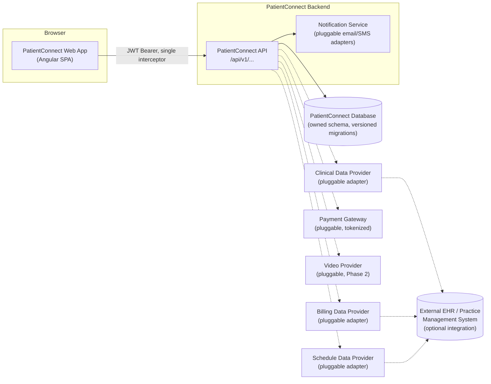

# PatientConnect — Product & Engineering Blueprint

**Purpose of this document:** a complete, standalone specification for building **PatientConnect**, a patient-portal product, from scratch — as an independent codebase with its own name, its own servers, its own database, and its own file/component naming. It was produced by analyzing the functionality of an existing reference patient-portal system and re-specifying every feature cleanly: new names throughout, no shared infrastructure, and every confirmed bug or security defect in the reference system deliberately designed out rather than carried forward.

**"PatientConnect" is a placeholder product name.** Swap it for your actual product/brand name before you start building — it's used consistently throughout this document (in route names, API paths as illustrative context, component prefixes, etc.) purely so every section reads as one coherent product rather than a loose bag of specs. Nothing about the architecture depends on the name itself.

**How to read this document:** Part 1 sets shared conventions every other part depends on (tech direction, API shape, environment/config strategy). Part 2 specifies the cross-cutting modules that every feature area plugs into (navigation shell, notifications, dashboard) — read these before the feature sections, since the feature sections assume they exist. Part 3 is the feature-by-feature specification (8 domains) — each is largely self-contained and can be assigned to a different engineer/pair. Part 4 is a practical build roadmap: suggested phase ordering, a master environment-variable reference, and a pre-launch checklist.

**What this document is not:** it is not a description of the reference system as it exists today (for that, see a separate as-is architecture document if one exists for your situation). Every data model, endpoint, and file name below is newly designed for PatientConnect and is not drawn from — and should never be confused with — the reference system's actual database schema, class names, or URLs.

---

## Table of Contents

**Part 1 — Platform Foundations**
1. Product & Technical Direction
2. API Conventions

**Part 2 — Cross-Cutting Modules**
3. Application Shell & Navigation
4. Notifications & Alerts
5. Dashboard

**Part 3 — Feature Domains**
6. Authentication & Account Access
7. Patient Self-Registration, Demographics & Admin Approval
8. Appointment Scheduling & Visit History
9. Secure Messaging
10. Health Records & Trends
11. Document Templates, E-Signatures, Document Library & Health Summary Export
12. Billing & Payments
13. Video Visits *(Phase 2)*

**Part 4 — Build Roadmap**
14. Suggested Build Order
15. Master Environment Variable Reference
16. Pre-Launch Checklist

---

## Part 1 — Platform Foundations

### 1. Product & Technical Direction

**Suggested stack** (a recommendation, not a mandate — pick based on your team's actual strengths):

- **Frontend**: Angular (current LTS), single deployable SPA, organized into feature modules per domain below (lazy-loaded, unlike a single monolithic bundle) — kebab-case component folders, one component per screen/widget as specified in each domain's "Screens / UI Components" table.
- **Backend**: any modern, well-supported REST framework your team is proficient in (e.g., Laravel, NestJS, Django REST, ASP.NET Core, Spring Boot). Whichever is chosen, three things are non-negotiable regardless of framework, because they directly correct the reference system's worst defects: (1) all database access goes through the framework's ORM/query builder with bound parameters — no hand-built SQL strings; (2) database schema is managed by versioned migrations checked into source control, so a fresh environment can be provisioned from the repo alone; (3) all secrets and environment-specific values are read from environment configuration, never hardcoded in source.
- **Database**: a single relational database (PostgreSQL or MySQL) owned entirely by PatientConnect. Where a domain needs data from an external clinical/EHR or billing system, that integration is isolated behind a named adapter interface (see "Clinical Data Provider" in Health Records & Trends, and the equivalent patterns in Appointment Scheduling and Billing) — PatientConnect's own schema never mirrors a specific vendor's table names.
- **Testing**: unit tests colocated with each component/service (the reference system's own `*.spec.ts` convention is worth keeping — it's a framework convention, not something tied to the original product), plus integration tests for every ownership-scoping rule called out in each domain's Security Notes (the messaging domain's "two-account cross-access" test is the template — write the equivalent for every domain that scopes data to a caller's own id).

**High-level architecture:**

The dotted lines are all optional/pluggable: PatientConnect's own database and API are the system of record for everything it directly owns (accounts, appointments, messages, documents, billing records once synced/entered), while the "Data Provider" adapters are the *only* place code depends on the shape of an external clinical/practice-management system — swapping or removing that system touches one adapter, never the controllers, the Angular app, or the rest of the schema.

**Config/independence, restated as a platform-wide rule** (each domain section states it locally too, but it bears repeating once, plainly): every credential, connection string, base URL, and signing secret lives in environment variables (`.env` locally, a real secrets manager in any shared/production environment) — see Part 4, §15 for the master list. No domain's spec, code, or test fixtures should ever hardcode a real hostname, IP address, or credential.

### 2. API Conventions

Every endpoint table in every domain section follows these shared rules; they are not repeated per-domain.

- **Base path**: `/api/v1/...`, resource-oriented, plural nouns, standard HTTP verbs (`GET` list/detail, `POST` create, `PATCH` partial update, `PUT` full replace where used, `DELETE` remove) — never a verb-shaped, action-named path.
- **Auth header**: `Authorization: Bearer <access_token>` on every protected call, attached by the single Angular HTTP interceptor described in Authentication & Account Access — no feature service ever builds this header itself.
- **Success envelope**: list endpoints return `{ data: [...], meta: { page, pageSize, total } }` (or the domain-specific pagination shape already given in that section); single-resource endpoints return `{ data: {...} }`. A few domains' drafts below use a bare object instead of `{ data }` for brevity — treat `{ data: ... }` as the house style when implementing, for consistency across the whole API surface.
- **Error envelope** (applies uniformly, replacing each domain's shorthand `{ message }` example with this fuller shape in implementation): `{ "error": { "code": "STRING_ERROR_CODE", "message": "Human-readable, safe-to-display message", "fields": { "fieldName": "field-specific message" } , "requestId": "uuid" } }`. `fields` is present only on `422` validation errors. `requestId` is a per-request correlation id (also emitted in server logs) so a user-reported issue can be traced through logs without exposing internals to the client.
- **Pagination defaults**: `page` 1-indexed, `pageSize`/`perPage` defaults to 20, capped at 100 platform-wide unless a domain states otherwise; a page past the last one returns an empty `data` array with an accurate `total`, never an error.
- **Idempotency**: any endpoint that causes a real-world side effect with a cost to getting it wrong (payments, refunds) requires a client-supplied `idempotencyKey`, per that domain's spec.
- **Ownership resolution**: "who is the caller" is *always* resolved server-side from the verified access token's subject claim, never from a client-supplied id in a path, query string, or body — this is stated per-domain because it's the single most important recurring rule in this document, not because it varies.

---

## Part 2 — Cross-Cutting Modules

These three modules have no independent "screen" of their own that a user navigates to by choice (with the partial exception of the Dashboard) — they are the connective tissue every feature domain in Part 3 plugs into. Build them early (see Part 4, §14) since almost every domain section references one of them.

### 3. Application Shell & Navigation

**Purpose**

Every authenticated screen in every domain renders inside one shared shell: a top/side navigation frame that shows the right menu items for the caller's role, surfaces the badge counts each domain publishes (unread messages, new lab results, pending registrations for admins), hosts the logout control, and is the single place that reacts to a global session-expired event from the Authentication module's HTTP interceptor. No domain module builds its own top-level chrome.

**Screens / UI Components**

- `app-shell.component` — top-level layout: header bar, role-driven side/top nav, `<router-outlet>` for the active domain's routed content, and a global toast/notification-banner host.
- `nav-menu.component` — renders the nav item list from a static, role-keyed configuration (below); highlights the active route; renders badge counts next to items that have one.
- `session-expired-toast.component` — global toast shown when the central HTTP interceptor (see Authentication & Account Access) receives an unrecoverable 401 or the idle timer fires; offers a "Log in again" action.
- `breadcrumb-bar.component` — optional, renders a breadcrumb trail for screens nested more than one level deep (e.g., Appointments → Visit Summary).

**Navigation configuration** (illustrative — the authoritative list lives in each domain's own routing, this just shows how roles differ):

| Nav item | Patient | Provider | Admin | Badge source |
|---|---|---|---|---|
| Dashboard | ✔ | ✔ | ✔ | — |
| Appointments | ✔ | ✔ (queue view) | — | — |
| Messages | ✔ | ✔ | — | Messaging `folder-counts.inbox_unread` |
| Health Records | ✔ | — (uses provider-side EHR tooling, out of scope) | — | Health Records `alerts/summary.unreadLabResultCount` |
| Documents | ✔ | ✔ | — | — |
| Billing | ✔ | — | ✔ (billing-staff) | — |
| Video Visits *(Phase 2)* | ✔ | ✔ | — | — |
| Registrations | — | — | ✔ | count of `status = PENDING` requests |
| Staff Accounts | — | — | ✔ | — |

**Business Rules**

- The nav configuration is a static, versioned artifact (not fetched from an API) — it changes when a developer ships a new route, not at runtime.
- Badge counts are fetched by the shell once on load and refreshed after any action in the owning domain that would change them (e.g., after sending/trashing a message, after marking a lab result read) — the shell does not poll continuously; each domain's own service is responsible for telling the shell to refresh (e.g. via a shared `NavBadgeService` that domains push updates into).
- The shell, not any individual domain component, owns the single subscription to the central HTTP interceptor's "session expired" event stream, so a session timeout is handled exactly once regardless of which screen was active.

**Security Notes**

- The nav menu's role-based item visibility is a UX convenience only, exactly like every other client-side gating decision in this product — the actual authorization for each route's data still happens server-side per that domain's own rules. Hiding "Billing" from a patient's nav does not, by itself, stop a `provider`-role token from calling billing endpoints; that's enforced by the endpoint's own auth check.

---

### 4. Notifications & Alerts

**Purpose**

Nearly every domain in this document sends an email at some point — a password reset link, a username recovery, a registration approval/rejection with credentials, an appointment reminder, a new-message alert — and several reference a generic "notification" without specifying how it's actually sent. This module is that missing piece: one `NotificationService` interface behind pluggable channel adapters, one place notification content and delivery status live, and one place a user controls what they want to be notified about and how.

**User Flows**

1. **A domain triggers a notification** (internal, not user-facing): any backend module calls `NotificationService.send(eventType, recipientUserId, templateData)` — e.g. Authentication calls it with `event_type: password_reset_requested`; Messaging calls it with `event_type: new_message_received`. The calling module never talks to an email/SMS provider directly.
2. **Notification is rendered and dispatched**: the service loads the `NotificationTemplate` for that `event_type`, renders it with `templateData`, checks the recipient's `NotificationPreference` for that event type + channel, and dispatches through the configured channel adapter(s) (email always available; SMS/in-app per preference). A `NotificationLog` row is created in `queued` status before dispatch is attempted.
3. **Delivery outcome recorded**: on success, `NotificationLog.status` → `sent`; on failure, → `failed` with an error reason, and the job is retried with backoff up to a configured maximum before landing in a dead-letter state that surfaces to an admin.
4. **Patient manages notification preferences**: from Account Settings, patient opens "Notification Preferences," sees a table of event types (appointment reminders, new messages, billing statements ready, etc.) each with Email/SMS/In-App toggles, and saves changes via `PATCH /api/v1/accounts/me/notification-preferences`.
5. **In-app notifications**: any event type configured for the `in_app` channel also creates a row the patient can see in `notification-bell.component`'s dropdown from the app shell; opening it marks the relevant entries read.

**Screens / UI Components**

- `notification-preferences.component` — per-event-type Email/SMS/In-App toggle grid.
- `notification-bell.component` — shell-hosted icon with unread-count badge and a dropdown list of recent in-app notifications; "mark all read" action.

**Data Model**

`NotificationTemplate`
- `id` (UUID, PK), `event_type` (string, unique, e.g. `password_reset_requested`, `appointment_reminder`, `new_message_received`, `registration_approved`, `registration_rejected`, `billing_statement_ready`), `channel` (`email`\|`sms`\|`in_app`), `subject_template` (string, nullable — email/SMS only), `body_template` (text, supports the same `{{field}}` merge-placeholder syntax used by Document Templates), `is_active` (boolean, default true)

`NotificationPreference`
- `id` (UUID, PK), `user_id` (UUID, FK → users, not null), `event_type` (string, not null), `channel` (`email`\|`sms`\|`in_app`), `enabled` (boolean, default true — some event types, e.g. password reset, are not user-disable-able and simply have no row/UI toggle)
- unique (`user_id`, `event_type`, `channel`)

`NotificationLog`
- `id` (UUID, PK), `recipient_user_id` (UUID, FK), `event_type` (string), `channel` (`email`\|`sms`\|`in_app`), `status` (`queued`\|`sent`\|`failed`\|`dead_letter`), `attempt_count` (int, default 0), `last_error` (text, nullable), `sent_at` (timestamp, nullable), `read_at` (timestamp, nullable — `in_app` only), `created_at` (timestamp)

**API Endpoints**

| Method | Path | Request body | Response body | Auth |
|---|---|---|---|---|
| GET | `/api/v1/accounts/me/notification-preferences` | — | `{ data: NotificationPreference[] }` | JWT (self) |
| PATCH | `/api/v1/accounts/me/notification-preferences` | `{ preferences: [{eventType, channel, enabled}] }` | `{ data: NotificationPreference[] }` | JWT (self) |
| GET | `/api/v1/accounts/me/notifications` | query: `unreadOnly?`, `page` | `{ data: NotificationLog[], meta }` (`in_app` channel only) | JWT (self) |
| PATCH | `/api/v1/accounts/me/notifications/{id}/read-status` | `{ isRead: true }` | `{ data: NotificationLog }` | JWT (self, owns the log row) |

**Business Rules & Validation**

- Security-critical event types (`password_reset_requested`, `username_recovery_requested`, `registration_approved`) are always sent via email regardless of preference — a user cannot disable the channel that delivers their own credential-recovery flow. Preference toggles apply to discretionary notifications (reminders, new-message alerts, billing-ready).
- Failed sends retry with exponential backoff (e.g. 1m, 5m, 30m) up to a configured max attempt count, then move to `dead_letter` and are surfaced on an admin operations view — a mail-provider outage degrades gracefully (the triggering action, e.g. registration approval, still succeeds) rather than blocking the calling domain's own transaction.
- Every channel adapter (email provider, SMS provider) is configured entirely from environment variables and selected via an adapter interface, mirroring the Clinical/Schedule/Billing "Data Provider" pattern used elsewhere in this document — no domain module ever imports a provider SDK directly.

**Edge Cases & Error States**

- Recipient has no preference row for a given event type/channel → defaults to `enabled = true` for discretionary types (opt-out model), so a brand-new account still receives reminders until they explicitly turn them off.
- Recipient disables all channels for a discretionary event type → the triggering domain action still succeeds; simply no notification is dispatched (a `NotificationLog` row is still written with `status: skipped` for auditability).
- Template rendering fails (e.g. a merge field referenced in `body_template` isn't present in `templateData`) → the send is not attempted, `NotificationLog.status = failed` with a clear internal error, and this is treated as a template-authoring bug to fix, not a user-facing failure.

**Security Notes**

- Mail/SMS provider credentials are environment-sourced, in exactly one place, per the platform-wide config rule in Part 1.
- `NotificationLog`/`NotificationPreference` reads and writes are always scoped to the authenticated user's own `user_id` — no endpoint accepts another user's id for these resources.
- Notification bodies never include full PHI in-line for channels outside the product itself (e.g. an SMS reminder says "You have an appointment tomorrow at 2pm — view details in PatientConnect," not the visit reason or diagnosis) — the notification is a pointer back into the authenticated app, not a PHI transport itself.

---

### 5. Dashboard

**Purpose**

The landing screen after login. Rather than one backend endpoint that knows about every other domain (which would recreate exactly the kind of tightly-coupled, hard-to-evolve backend the rest of this document avoids), the dashboard is a **frontend composition**: `patient-dashboard.component` fans out, in parallel, to each domain's own existing summary endpoint and assembles the results client-side. This is a deliberate architectural choice — documented here so it isn't re-litigated per domain — because it keeps every domain module independently deployable and testable without the dashboard becoming a shared dependency every domain must update in lockstep.

**User Flows**

1. Patient logs in and lands on `/dashboard`.
2. `patient-dashboard.component` issues, in parallel: Health Records' `GET /patients/{id}/alerts/summary` (upcoming appointments + unread labs), Messaging's `GET /messages/folder-counts` (unread count), Billing's `GET /patients/me/billing-statements?pageSize=1` (most recent balance due), Registration's own-request status if the patient arrived via a not-yet-approved flow (not applicable once active), and, once Phase 2 ships, Video Visits' `GET /video-visits?status=upcoming`.
3. Each panel renders independently and fails independently — a Billing outage shows an error state in the billing tile without blocking the rest of the dashboard from rendering (no single failure takes down the whole page).
4. Tapping any tile deep-links into that domain's own screen.

A parallel, smaller `staff-dashboard.component` exists for `provider`/`admin` roles (today's video/appointment queue for providers, pending-registration count for admins) following the identical fan-out pattern — out of deep scope for this document beyond noting it follows the same composition rule rather than a bespoke aggregator endpoint.

**Screens / UI Components**

- `patient-dashboard.component` — container; issues the parallel fan-out and lays out the tiles below.
- `dashboard-alerts-tile.component` — wraps Health Records' `dashboard-alert-summary.component`.
- `dashboard-messages-tile.component` — unread message count, links to Inbox.
- `dashboard-billing-tile.component` — most recent balance due, links to Billing.
- `staff-dashboard.component` — provider/admin landing equivalent (brief; see above).

**Business Rules**

- The dashboard never introduces a new backend aggregation endpoint or a new database table — it is purely a frontend composition over endpoints each domain already exposes for its own primary screen. If a future need genuinely requires server-side aggregation (e.g. for a mobile client with poor round-trip tolerance), that's a deliberate future decision to revisit, not the MVP default.
- Each tile has its own loading/error/empty state and a timeout; one slow domain never blocks the others from rendering.

---

## Part 3 — Feature Domains

Each section below is a complete, largely self-contained specification for one functional area, written so a team can build it without needing to have seen the reference system this product's functionality was derived from. Every section follows the same shape: Purpose, User Flows, Screens/UI Components, Data Model, API Endpoints, Business Rules & Validation, Edge Cases & Error States, and Security Notes. All eight assume the shared conventions from Part 1 and the cross-cutting modules from Part 2 already exist.

---

### 6. Authentication & Account Access

**Purpose**

This module is the identity backbone of PatientConnect: it authenticates patients and staff (providers/admins) into separate but architecturally unified sessions, issues and rotates the JWT-based credentials that every other domain's API calls rely on for authorization, and provides self-service account recovery (forgotten username, forgotten password) and in-session password changes. Every other feature area in the product treats this module's access token and `role` claim as the single source of truth for "who is calling and what are they allowed to touch" — no other domain should implement its own login, token issuance, or password storage.

**User Flows**

1. **Patient login**
   1. Patient opens `/login` and submits username + password on `patient-login.component`.
   2. Client calls `POST /api/v1/patient-sessions`.
   3. Server verifies credentials against the `Account` record (role = `patient`) using constant-time bcrypt/argon2 comparison, checks `status`/`locked_until`, and on success issues a short-lived access token + refresh token and records an `AuthEvent`.
   4. Client stores the access token in memory (not `localStorage`) and the refresh token in an `HttpOnly`, `Secure`, `SameSite=Strict` cookie set by the server; it then fetches `GET /api/v1/accounts/me` to hydrate the session and routes to the patient dashboard.
   5. On invalid credentials, server returns a generic 401; client increments no client-side counter (server owns lockout) and shows a single generic error.

2. **Provider/staff login**
   1. Staff opens `/staff-login` (a visually and route-distinct screen from patient login) and submits credentials on `staff-login.component`.
   2. Client calls `POST /api/v1/staff-sessions`.
   3. Server looks up `Account` scoped to role IN (`provider`,`admin`), verifies the hashed password, and on success returns the same token shape as patient login, with `role` set accordingly.
   4. Client routes to the staff/provider dashboard; UI chrome and available routes differ by `role`, but this is a convenience only — see Security Notes on backend enforcement.

3. **Forgot username**
   1. User opens `/forgot-username` and fills `forgot-username.component` (first name, last name, date of birth, email).
   2. Client calls `POST /api/v1/username-recoveries`.
   3. Server matches an `Account`'s linked `PatientProfile` on first name + last name + date of birth + contact email (all four must match exactly). If found, it emails the associated `username` to that profile's email address.
   4. Regardless of match, the server returns the same generic "if the details match an account, we've emailed the username" response (prevents account enumeration) and the client shows that message.

4. **Forgot password (request + reset)**
   1. User opens `/forgot-password` and submits an email on `forgot-password-request.component`.
   2. Client calls `POST /api/v1/password-resets`.
   3. Server looks up an active `Account` by email; if found, generates a high-entropy random token, stores only its SHA-256 hash in `PasswordResetRequest` with a 30-minute expiry, and emails a reset link containing the raw token as a query parameter (e.g. `https://<app-host>/reset-password?token=...`) to a URL driven entirely by the `PASSWORD_RESET_BASE_URL` environment variable.
   4. Server always returns the same generic "if that email is registered, a reset link has been sent" response.
   5. User clicks the link; `reset-password.component` reads the token from the query string and presents a new-password + confirm-password form.
   6. Client calls `PATCH /api/v1/password-resets/{token}` with the new password.
   7. Server hashes the incoming token, looks up an unexpired, unused `PasswordResetRequest` by hash, verifies expiry and single-use (`used_at IS NULL`), hashes the new password, updates the `Account`, marks the request `used_at`, revokes all of that account's existing refresh tokens (forced re-login everywhere), and records an `AuthEvent`.
   8. Client shows a success message and routes to login; an expired/used/unknown token yields a generic error inviting the user to request a new link.

5. **Change password while logged in**
   1. Authenticated user opens `/account/change-password` (`change-password.component`), enters current password, new password, confirm new password.
   2. Client calls `PATCH /api/v1/accounts/me/password` with the current access token attached.
   3. Server resolves the account strictly from the access token's subject claim (never from any client-supplied id), verifies `current_password` against the stored hash, validates the new password against policy, hashes and stores it, revokes all other active refresh tokens for that account (keeping the current session alive), and records an `AuthEvent`.
   4. Client shows success/failure inline; a wrong current password returns a distinct, generic "current password is incorrect" error without revealing anything else about the account.

6. **Session lifecycle (used by every other domain)**
   1. Client attaches the in-memory access token to every API call via a single central HTTP interceptor — individual feature services never construct their own `Authorization` header.
   2. When an API call returns 401 with a "token expired" reason, the interceptor transparently calls `POST /api/v1/access-tokens` with the refresh cookie, receives a new access token (and rotated refresh cookie), and retries the original request once.
   3. If refresh also fails (expired/revoked/reused refresh token), the interceptor clears in-memory state and routes to `/login`.
   4. Logout: client calls `DELETE /api/v1/sessions/current`, server revokes the current refresh token server-side and clears the cookie; client clears in-memory access token and routes to `/login`.
   5. **Idle timeout:** a client-side idle timer (no user interaction — mouse/keyboard/touch — for 20 minutes for patients, 15 minutes for staff) triggers the same logout call and routes to `/login` showing `session-expired-notice.component` with an "you were signed out due to inactivity" message, independent of whether the access/refresh tokens are still technically valid. This bounds how long a PHI-bearing session can sit open in an unattended browser tab.

7. **Staff account provisioning (admin-only)**
   1. An authenticated admin opens "Staff Accounts" and selects "Add Staff Account."
   2. Admin enters the new staff member's name, work email, title/department, and role (`provider` or `admin`).
   3. Client calls `POST /api/v1/staff-accounts`.
   4. Server creates the `StaffProfile` + `Account` row, generates a high-entropy temporary password (hashed before storage, transmitted exactly once), sets `must_change_password = true`, and emails the new staff member their username and temporary password.
   5. Admin can later deactivate/reactivate a staff account (`PATCH /api/v1/staff-accounts/{id}` with `{status}`), which immediately revokes all of that account's refresh tokens on deactivation.
   6. **Bootstrapping the very first admin:** since `POST /api/v1/staff-accounts` itself requires an existing admin, the very first admin account is created by a one-time deployment-time seed script/CLI command (run against the production database once, outside the HTTP API, with its own audit log entry) rather than through any HTTP endpoint — see the Build Roadmap's environment/deployment checklist for the exact command shape.

**Screens / UI Components**

- `patient-login.component` — username/password entry for patients. Fields: `username` (required), `password` (required). Client-side validation is presence-only; all real validation (format, correctness) happens server-side to avoid leaking which field is wrong.
- `staff-login.component` — separate-branded username/password entry for providers/admins, at a distinct route from patient login. Same field/validation shape as above.
- `forgot-username.component` — recovery-by-identity form. Fields: `firstName` (required), `lastName` (required), `dateOfBirth` (required, valid past date, age ≥ some minimum), `email` (required, valid email format). All four required so the match is precise, not a partial/fuzzy lookup.
- `forgot-password-request.component` — email-only request form. Fields: `email` (required, valid email format).
- `reset-password.component` — consumes the emailed token (read from the URL query string, never displayed as an editable field). Fields: `newPassword` (required, meets password policy — see Business Rules), `confirmPassword` (required, must equal `newPassword`).
- `change-password.component` — in-session password change. Fields: `currentPassword` (required), `newPassword` (required, meets password policy, must differ from `currentPassword`), `confirmPassword` (required, must equal `newPassword`).
- `account-locked-notice.component` — shown when login fails because the account is temporarily locked; states that the account is locked and roughly when to retry, without confirming whether the username itself was valid.
- `session-expired-notice.component` — shown by the auth interceptor's failure path when a refresh attempt fails, before redirecting to login.

**Data Model**

`Account`
- `id`: UUID, PK
- `role`: ENUM(`patient`,`provider`,`admin`), NOT NULL
- `username`: VARCHAR(50), NOT NULL, UNIQUE, indexed
- `password_hash`: VARCHAR(255), NOT NULL (bcrypt or argon2id output — never plaintext, for every role)
- `email`: VARCHAR(255), NOT NULL, UNIQUE
- `status`: ENUM(`active`,`locked`,`disabled`), NOT NULL, DEFAULT `active`
- `failed_login_attempts`: SMALLINT, NOT NULL, DEFAULT 0
- `locked_until`: TIMESTAMP, NULL
- `must_change_password`: BOOLEAN, NOT NULL, DEFAULT false
- `last_login_at`: TIMESTAMP, NULL
- `patient_profile_id`: UUID, FK → `PatientProfile.id`, NULL (set only when `role = patient`)
- `staff_profile_id`: UUID, FK → `StaffProfile.id`, NULL (set only when `role IN (provider, admin)`)
- `created_at`, `updated_at`: TIMESTAMP, NOT NULL
- CONSTRAINT: exactly one of `patient_profile_id` / `staff_profile_id` is non-null, matching `role`.

`PatientProfile` (identity fields owned by auth; full clinical/demographic record lives in the patient-records domain and is linked via `external_patient_ref`)
- `id`: UUID, PK
- `first_name`, `last_name`: VARCHAR(100), NOT NULL
- `date_of_birth`: DATE, NOT NULL
- `contact_email`: VARCHAR(255), NOT NULL
- `external_patient_ref`: VARCHAR(64), NULL — opaque foreign key into the clinical-records domain, never exposed as an editable client field

`StaffProfile`
- `id`: UUID, PK
- `first_name`, `last_name`: VARCHAR(100), NOT NULL
- `work_email`: VARCHAR(255), NOT NULL, UNIQUE
- `title`: VARCHAR(100), NULL
- `department`: VARCHAR(100), NULL
- `active`: BOOLEAN, NOT NULL, DEFAULT true

`RefreshToken`
- `id`: UUID, PK
- `account_id`: UUID, FK → `Account.id`, NOT NULL, indexed
- `token_hash`: VARCHAR(255), NOT NULL, UNIQUE — SHA-256 of the raw token; raw value is never persisted
- `issued_at`, `expires_at`: TIMESTAMP, NOT NULL
- `revoked_at`: TIMESTAMP, NULL
- `rotated_from_id`: UUID, FK → `RefreshToken.id`, NULL (rotation chain for reuse detection)
- `user_agent`: VARCHAR(255), NULL
- `ip_address`: VARCHAR(45), NULL

`PasswordResetRequest`
- `id`: UUID, PK
- `account_id`: UUID, FK → `Account.id`, NOT NULL, indexed
- `token_hash`: VARCHAR(255), NOT NULL, UNIQUE — SHA-256 of the emailed token
- `expires_at`: TIMESTAMP, NOT NULL (created_at + 30 min)
- `used_at`: TIMESTAMP, NULL
- `requested_ip`: VARCHAR(45), NULL
- `created_at`: TIMESTAMP, NOT NULL

`AuthEvent` (audit trail + rate-limiting/lockout signal)
- `id`: UUID, PK
- `account_id`: UUID, FK → `Account.id`, NULL (null when the attempted identifier didn't resolve to an account)
- `attempted_identifier`: VARCHAR(255), NULL — username/email as typed, for tracking pre-resolution abuse
- `event_type`: ENUM(`login_success`,`login_failure`,`password_reset_requested`,`password_reset_completed`,`username_recovery_requested`,`logout`,`token_refresh`,`token_reuse_detected`), NOT NULL
- `ip_address`: VARCHAR(45), NOT NULL
- `user_agent`: VARCHAR(255), NULL
- `created_at`: TIMESTAMP, NOT NULL, indexed

**API Endpoints**

| Method | Path | Request Body | Response Body | Auth Requirement |
|---|---|---|---|---|
| POST | `/api/v1/patient-sessions` | `{ username, password }` | `{ access_token, expires_in, account: { id, role, display_name } }` (refresh token set as HttpOnly cookie) | None (public, rate-limited) |
| POST | `/api/v1/staff-sessions` | `{ username, password }` | `{ access_token, expires_in, account: { id, role, display_name } }` (refresh token set as HttpOnly cookie) | None (public, rate-limited) |
| POST | `/api/v1/access-tokens` | `{}` (refresh token read from HttpOnly cookie) | `{ access_token, expires_in }` (rotated refresh token re-set as cookie) | Valid refresh token (cookie) |
| DELETE | `/api/v1/sessions/current` | none | `204 No Content` | Access token (Bearer) |
| POST | `/api/v1/username-recoveries` | `{ first_name, last_name, date_of_birth, email }` | `{ message }` (always generic) | None (public, rate-limited) |
| POST | `/api/v1/password-resets` | `{ email }` | `{ message }` (always generic) | None (public, rate-limited) |
| PATCH | `/api/v1/password-resets/{token}` | `{ new_password, confirm_password }` | `{ message }` | None — the token itself is the credential (public, rate-limited) |
| PATCH | `/api/v1/accounts/me/password` | `{ current_password, new_password, confirm_password }` | `{ message }` | Access token (Bearer); account resolved from token subject only |
| GET | `/api/v1/accounts/me` | none | `{ id, role, username, email, display_name, must_change_password }` | Access token (Bearer) |
| POST | `/api/v1/staff-accounts` | `{ first_name, last_name, work_email, title?, department?, role: provider\|admin }` | `{ id, role, username, work_email, status }` | Access token (Bearer); role `admin` only |
| PATCH | `/api/v1/staff-accounts/{id}` | `{ status: active\|disabled, title?, department? }` | `{ id, role, username, work_email, status }` | Access token (Bearer); role `admin` only |

**Business Rules & Validation**

- Passwords (all roles, including provider/admin) are hashed with bcrypt (cost ≥ 12) or argon2id before storage; the raw value is never logged, cached, or compared with `==`/`strcmp`.
- Password policy for new/changed passwords: minimum 10 characters, at least one uppercase, one lowercase, one digit, one symbol; must not equal the current password (for change-password) or match the username/email local-part.
- Username-recovery match requires **all four** fields (first name, last name, DOB, email) to match a single account exactly (case-insensitive on names/email); a partial match is treated as no match.
- Password-reset tokens are single-use (`used_at` set atomically on consumption) and expire 30 minutes after issuance; consuming a token invalidates all other outstanding reset tokens for that account.
- Successfully resetting or changing a password revokes all other active refresh tokens for that account (change-password keeps the current session's refresh token alive; reset-password revokes all of them, since the user isn't authenticated when resetting).
- Access tokens expire in 15 minutes; refresh tokens expire in 30 days and rotate on every use (old token immediately marked `revoked_at`, new one issued with `rotated_from_id` pointing to it).
- `role` and account identity are always taken from the verified access token's claims server-side; a client-supplied `patient_profile_id`, `account_id`, or similar in a request body or query string is never used for ownership decisions.
- Login, password-reset request, password-reset completion, and username-recovery endpoints are rate-limited per IP and per submitted identifier (e.g. 5 attempts / 15 minutes), with exponential backoff; five consecutive failed logins on an account sets `status = locked` and `locked_until = now + 15 min`, independent of the IP-based throttle.

**Edge Cases & Error States**

- Unknown username/password on either login endpoint → generic `401 { message: "Invalid credentials" }`; the response never indicates whether the username existed.
- Login against a `locked` account → `423 { message: "Account temporarily locked, try again later" }` without echoing `locked_until` precision beyond a coarse window.
- Login against a `disabled` staff/patient account (e.g. offboarded provider, deactivated patient) → same generic `401` as bad credentials — disabled state is never surfaced.
- `POST /api/v1/username-recoveries` / `POST /api/v1/password-resets` with no matching account → identical `200` generic response as a match, to prevent enumeration; only server-side logs (`AuthEvent`) distinguish the two.
- `PATCH /api/v1/password-resets/{token}` with an expired, already-used, or unknown token → `410 { message: "This reset link is invalid or has expired. Please request a new one." }`.
- `PATCH /api/v1/accounts/me/password` with a wrong `current_password` → `422 { message: "Current password is incorrect" }`; new/confirm mismatch is caught client-side first but re-validated server-side as `422`.
- Expired or malformed access token on any protected call → `401 { message: "Session expired" }`, triggering the interceptor's silent-refresh path rather than an immediate logout.
- Refresh token reused after rotation (replay of an already-rotated token) → treated as a compromise signal: the entire refresh-token family for that account is revoked, an `AuthEvent` of type `token_reuse_detected` is recorded, and the client is forced to re-login.
- Missing/absent `Authorization` header on a protected endpoint → `401 { message: "Authentication required" }`, never a silent pass-through.
- Decoding a token to a subject that no longer resolves to an existing/active `Account` (deleted or disabled after issuance) → treated identically to "invalid token": `401`, request rejected before reaching any handler — never proceeds with a null/undefined account object.

**Security Notes**

- **Staff password storage**: `StaffProfile`/`Account` passwords for provider and admin roles go through the exact same bcrypt/argon2id hashing and `verify()` comparison path as patient accounts — there is one password-verification code path for all roles, so there is no plaintext-comparison branch to regress into.
- **JWT signing secret**: the signing secret is read once from `JWT_SECRET` in environment config (`.env` / secrets manager) by a single shared token-issuing/verifying module; it is never declared as a string literal anywhere else in source, so issuance and verification are structurally guaranteed to use the same, non-duplicated secret.
- **Null-safety on token resolution**: the auth middleware/guard that resolves an access token's subject into an `Account` always checks for a null/missing result and short-circuits with `401` before calling any controller — no downstream code ever dereferences a possibly-null authenticated-account object.
- **No static tokens in the client bundle**: the Angular build contains no embedded long-lived token of any kind. All API calls use only the live, per-session access token held in memory; there is no constant exported from an environment/config file that doubles as a bearer credential.
- **Central HTTP interceptor**: a single Angular `HttpInterceptor` is the only place that reads the in-memory access token and attaches `Authorization: Bearer <token>`; individual feature services (appointments, records, messaging, etc.) never construct their own auth headers, so there is one place to get token attachment, refresh, and 401-handling right.
- **Rate limiting & lockout**: login, password-reset, and username-recovery endpoints sit behind per-IP and per-identifier throttling plus account-level lockout after repeated failures (see Business Rules) — none of these endpoints are exempt from throttling middleware.
- **Real backend authorization, not UI hiding**: role checks that gate provider/admin-only or patient-only functionality are enforced by a server-side authorization check (role claim + resource-ownership check against the token's subject) on every request; the Angular route guards and conditional UI are a UX convenience only and are never the actual security boundary. Every ownership-sensitive query (e.g. "this patient's own data") is scoped server-side to the authenticated subject's linked `patient_profile_id`/`staff_profile_id` — a client-supplied id in a URL or payload is never trusted for that scoping.
- **Refresh token handling**: refresh tokens are delivered only via `HttpOnly`, `Secure`, `SameSite=Strict` cookies (never accessible to page JavaScript), are stored server-side only as a SHA-256 hash, and rotate on every use with reuse-detection revoking the whole token family — limiting the blast radius of a leaked refresh token far below the reference system's single long-lived static credential.
- **Reset-link tokens**: emailed reset tokens are single-use, short-lived (30 min), stored hashed (never in plaintext) server-side, and access logs/URL logging middleware are configured to redact the `token` path segment on `password-resets` routes so it never lands in plaintext log files.
- **Config/independence**: `JWT_SECRET`, database credentials, mail-provider credentials, and `PASSWORD_RESET_BASE_URL` are all environment-sourced; the Angular `environment.ts` carries only the public API base URL, never a secret.
- **No raw SQL string interpolation**: every `Account`/`PatientProfile`/`StaffProfile` lookup — by username, email, or the first-name/last-name/DOB/email combination used in username recovery — is executed exclusively through parameterized queries or ORM-bound methods; no user-supplied value is ever concatenated into SQL text.
- **Reset-link Referer leakage prevention**: `reset-password.component`'s page response sets `Referrer-Policy: no-referrer` (or `strict-origin`), and the page loads no third-party-origin resource (analytics, web fonts, etc.) before the `PATCH` call that consumes and invalidates the token — so the raw token in the URL can never leak to a third party via the `Referer` header.
- **Username-enumeration-safe timing**: when a login identifier doesn't resolve to any `Account`, the server still performs a dummy bcrypt/argon2 verify against a fixed placeholder hash before returning the generic 401, so response timing for "no such account" is statistically indistinguishable from "wrong password."
- **Phase 2 — Multi-factor authentication**: not in MVP scope, but explicitly planned rather than absent: `mfa_enabled` / `mfa_secret_encrypted` / backup-code fields on `Account`, a `POST /api/v1/accounts/me/mfa` TOTP enrollment endpoint, and a step-up challenge inserted into the staff-login flow before token issuance (mandatory for `provider`/`admin` roles given their elevated read access to PHI across the whole product; optional for patients). Scoped the same way as Video Visits (§3.8) — feature-flagged, built after MVP.

---

### 7. Patient Self-Registration, Demographics & Admin Approval

**Purpose**

This module lets a prospective patient submit a complete intake packet — identity, contact, emergency contact, medication/allergy history, past medical/family/social history, surgical history, prior hospitalizations, insurance, pharmacy preference, and signed consent — through a guided multi-step wizard in PatientConnect, without creating a live account. Every submission lands as a `PENDING` registration request that a clinic administrator reviews; only on approval does PatientConnect provision a real patient record and portal login and email the new patient their credentials. Once a patient has an active account, this module also powers their ongoing demographics screen, where they keep their own name, address, contact, emergency-contact, insurance, pharmacy, and employer information up to date, and lets them download a PDF copy of the information they submitted at intake.

**User Flows**

1. **Self-registration (prospective patient, no account yet)**
   1. Visitor opens the public "Register" wizard on the PatientConnect marketing/login page.
   2. Wizard loads reference/lookup lists (states, countries, languages, marital statuses, race, ethnicity, insurance companies, pharmacies, provider list, relationship types) to populate all dropdowns.
   3. Step 1 – Basic Information: identity, DOB, contact, address, and emergency contact.
   4. Step 2 – Choices & Insurance: preferred provider, communication preferences, responsible party, payment method, and primary insurance (existing company or "add a new insurance company").
   5. Step 3 – Pharmacy: preferred pharmacy (existing or "add a new pharmacy").
   6. Step 4 – Current Medications & Allergies.
   7. Step 5 – Past Medical History (multi-select checklist by body system).
   8. Step 6 – Family Medical History (per-condition, per-relative checklist).
   9. Step 7 – Social History (tobacco, alcohol, drug use, cardiovascular habits) plus free-text notes.
   10. Step 8 – Surgical History (checklist of common procedures with a date per procedure performed, plus a free-text "other" field).
   11. Step 9 – Hospitalization/Prior Procedures (up to 3 past-visit date + notes pairs).
   12. Step 10 – Consent: patient reads the financial/insurance policy text and must check "I agree" to proceed.
   13. Step 11 – Review & Submit: read-only recap of every prior step, grouped by section, with "Edit" links that jump back to the relevant step.
   14. On submit, the wizard POSTs the whole packet as one `PENDING` registration request; the UI shows a confirmation modal ("All Set — Thank You") and offers a "Download PDF Statement" button that fetches a formatted copy of the submitted packet.
   15. The visitor is told the request is awaiting clinic review and does **not** receive login credentials at this point.

2. **Admin review of pending registrations**
   1. An authenticated admin opens the "Pending Registrations" list, which shows every request with `status = PENDING`, most recent first.
   2. Admin opens one request and reviews the full packet (all wizard sections) read-only, and assigns/verifies the treating provider.
   3. **Approve path:** admin selects a provider (if not already chosen by the patient) and confirms. PatientConnect creates the patient account (patient profile + all sub-history records), generates a strong temporary password, hashes it, creates the login credential, marks the request `APPROVED`, stamps `reviewed_by`/`reviewed_at`, and emails the new patient their username and a one-time password/reset link.
   4. **Reject path:** admin enters a rejection reason and confirms. PatientConnect marks the request `REJECTED`, stamps `reviewed_by`/`reviewed_at`/`rejection_reason`, and emails the applicant that their request was declined along with the reason.
   5. A processed request (approved or rejected) is removed from the pending queue but remains visible in an "all requests" history view for audit purposes.

3. **Patient updates demographics (existing account)**
   1. Logged-in patient opens "My Information."
   2. PatientConnect loads the patient's own record (looked up by the authenticated user's ID from the token — never a client-supplied ID) and lookup lists (states, countries, languages, race, ethnicity, marital status).
   3. Patient edits any editable field (name, address, contact numbers, marital status, race/ethnicity/language, emergency contact, employer, insurance, pharmacy) and clicks Save.
   4. PatientConnect validates and persists the change, confirms success, and reloads the record so the screen reflects what was actually saved.
   5. Patient may instead click "Cancel" to discard changes and return to the dashboard without saving.

**Screens / UI Components**

- `registration-wizard.component` — top-level multi-step container that owns overall wizard state, step navigation, and final submission; orchestrates the sub-step components below.
- `registration-basic-info-step.component` — identity, DOB, address, contact, and emergency-contact sub-form.
  - Fields & validation: `firstName`/`middleName`/`lastName` (letters only, 3–100 chars); `dateOfBirth` (required, must yield an age between 18 and 80 given the demo's adult-registration window, business-day date picker bounded accordingly); `phoneNumber` (10-digit or `+<country>-##########` pattern); `ssn` (masked input, format `###-##-####`, rejects obviously-invalid SSNs such as `000`, `666`, or `9xx` area numbers); `email` (RFC-lite pattern); `address` (min 10 chars, must contain at least one letter); `city` (letters/spaces/hyphens, min 5 chars, no doubled separators); `state`/`country` (select from lookup list); `zip` (5 or 5+4 digit ZIP); `maritalStatus`, `gender` (select from lookup list); emergency-contact `relationFirstName`/`relationLastName` (same name pattern), `relationPhoneNumber`, `relationEmail`, `relationshipType` (select).
- `registration-choices-step.component` — preferred provider, communication consent toggles, responsible party, payment method, and primary insurance selection, with an "Add New Insurance Company" inline sub-form.
  - Fields & validation: `preferredProviderId` (select, required), `allowPortalMessaging`/`allowSms`/`allowEmail` (booleans), `preferredLanguage` (select), `responsibleParty` (select: self/guardian/other), `paymentMethod` (select), `insuranceCompanyId` (select existing OR `newInsuranceCompanyName` when adding new — mutually exclusive, one required), `planName` (letters, min 5), `policyNumber`/`groupNumber` (digits, min 6), insurance mailing `city`/`state`/`country`/`zip` (same patterns as above), `subscriberRelationship` (select). New-company sub-fields mirror name/city/state/country/zip/plan/policy/group patterns.
- `registration-pharmacy-step.component` — preferred pharmacy selection with an "Add New Pharmacy" inline sub-form.
  - Fields & validation: `pharmacyId` (select existing) OR `newPharmacyName` (letters, required if adding new) plus `newPharmacyCity`/`newPharmacyState`/`newPharmacyCountry`/`newPharmacyZip`.
- `registration-medication-history-step.component` — current medications and known allergies.
  - Fields: `takesMedicationCurrently` (boolean), `medicationDetails` (free text, 2–100 chars, no double-spaces), `hasAllergies` (boolean), `allergyDetails` (free text, same pattern).
- `registration-medical-history-step.component` — multi-select checklist of past medical history by body system (Head, Genito-Urinary, Ears, Endocrine, Nose/Sinuses, Heme/Onc, Mouth/Throat/Teeth, Infections, Cardiovascular, Musculoskeletal, Respiratory, Skin, Gastrointestinal, Neurological, Psychiatric).
- `registration-family-history-step.component` — per-condition (Anemia, Asthma, Bleeding Disorder, Cancer, Diabetes, Epilepsy, Heart Disease, Skin Disease, Kidney Disease) checklist of affected relative (Father/Mother/Children/Other), plus free-text `familyHistoryNotes`.
- `registration-social-history-step.component` — tobacco use, alcohol use, drug use, and cardiovascular-habit checklists (values drawn from fixed option sets, e.g. tobacco: Current Everyday Smoker, Current Someday Smoker, Former Smoker, Heavy/Light Tobacco Smoker, Never Smoked, Unknown), plus free-text `socialHistoryNotes`.
- `registration-surgical-history-step.component` — checklist of common procedures (Angioplasty, Appendectomy, Arthroscopy, Back Surgery, CABG, Carpal Tunnel Release, Colectomy, Gastric Bypass, Hernia Repair, Liver Biopsy, Prostate Biopsy, TURP, Vasectomy, Augmentation Mammoplasty, Breast Biopsy, Mastectomy, Myomectomy, Vaginal Hysterectomy) each with an optional procedure date, plus free-text `otherProcedures`.
- `registration-hospitalization-step.component` — up to 3 past-visit entries, each a `visitDate` + free-text `notes`.
- `registration-consent-step.component` — displays financial/insurance policy consent text; `agreedToTerms` checkbox is required before the wizard can advance or submit.
- `registration-review-step.component` — read-only summary of every step's captured data grouped by section, with per-section "Edit" links that jump the wizard back to that step; triggers final submit.
- `registration-confirmation-modal.component` — post-submission confirmation with a "Download PDF Statement" action.
- `admin-pending-registrations-list.component` — paginated/filterable table of requests with `status = PENDING`, submission date, applicant name, and a link into detail.
- `admin-registration-detail.component` — read-only rendering of a single request's full packet plus Approve/Reject actions; the Approve action includes a provider picker.
- `admin-registration-reject-dialog.component` — captures a required rejection reason before confirming rejection.
- `patient-demographics.component` — logged-in patient's editable profile screen (name, address, contact, marital status, race/ethnicity/language, emergency contact, employer, insurance, pharmacy).
  - Fields & validation: same name/address/city/zip patterns as above; `email`, `homePhone`/`mobilePhone` (phone pattern); `ssn` (format-checked, masked on display); `race`/`ethnicity`/`language`/`maritalStatus`/`state`/`country` (selects from lookup lists); employer `name`/`address`/`city`/`state`/`zip`/`country`; emergency contact `name`/`relationship`/`phone`.
- `reference-data.service` (shared, not a screen) — fetches and caches the lookup lists (states, countries, languages, marital statuses, race, ethnicity, relationship types, insurance companies, pharmacies, provider list) used across all of the above screens.

**Data Model**

All primary keys are UUIDs (or the platform's standard auto-increment identity column) generated by the database — never computed client-side or via a `MAX(id)+1` read.

- **RegistrationRequest**
  - `id` (UUID, PK)
  - `status` (enum: `PENDING` \| `APPROVED` \| `REJECTED`, default `PENDING`, not null)
  - `submittedAt` (timestamp, not null)
  - `reviewedByAdminId` (UUID, FK → Admin, nullable)
  - `reviewedAt` (timestamp, nullable)
  - `rejectionReason` (text, nullable; required by app logic when `status = REJECTED`)
  - `resultingPatientId` (UUID, FK → Patient, nullable; set on approval)
  - `preferredProviderId` (UUID, FK → Provider, nullable)
  - one-to-one to each sub-entity below via `registrationRequestId`
- **RegistrationBasicInfo** (one per request)
  - `registrationRequestId` (UUID, FK, PK)
  - `firstName`, `middleName`, `lastName` (varchar(100), first/last not null)
  - `dateOfBirth` (date, not null)
  - `gender` (varchar(20))
  - `ssnEncrypted` (varchar, encrypted at rest, nullable)
  - `email` (varchar(255), not null, valid email format)
  - `phoneNumber` (varchar(20))
  - `addressLine1` (varchar(255)), `city` (varchar(100)), `state` (varchar(50)), `country` (varchar(50)), `postalCode` (varchar(10))
  - `maritalStatus` (varchar(30))
  - `emergencyContactFirstName`, `emergencyContactLastName` (varchar(100))
  - `emergencyContactPhone` (varchar(20)), `emergencyContactEmail` (varchar(255))
  - `emergencyContactRelationship` (varchar(50))
- **RegistrationInsuranceChoice** (one per request)
  - `registrationRequestId` (UUID, FK, PK)
  - `preferredLanguage` (varchar(50))
  - `allowPortalMessaging`, `allowSms`, `allowEmail` (boolean, default false)
  - `responsibleParty` (varchar(50)), `paymentMethod` (varchar(50))
  - `insuranceCompanyId` (UUID, FK → InsuranceCompany, nullable)
  - `newInsuranceCompanyName` (varchar(255), nullable — used when patient requests a company not yet in the lookup table)
  - `planName` (varchar(100)), `policyNumber` (varchar(50)), `groupNumber` (varchar(50))
  - `subscriberCity`/`subscriberState`/`subscriberCountry`/`subscriberZip` (varchar)
  - `subscriberRelationship` (varchar(50))
  - Constraint: exactly one of `insuranceCompanyId` or `newInsuranceCompanyName` must be set.
- **RegistrationPharmacyChoice** (one per request)
  - `registrationRequestId` (UUID, FK, PK)
  - `pharmacyId` (UUID, FK → Pharmacy, nullable)
  - `newPharmacyName`, `newPharmacyCity`, `newPharmacyState`, `newPharmacyCountry`, `newPharmacyZip` (varchar, nullable)
  - Constraint: exactly one of `pharmacyId` or `newPharmacyName` must be set.
- **RegistrationMedicationHistory** (one per request)
  - `registrationRequestId` (UUID, FK, PK)
  - `takesMedicationCurrently` (boolean), `medicationDetails` (text)
  - `hasAllergies` (boolean), `allergyDetails` (text)
- **RegistrationMedicalHistoryItem** (many per request — one row per selected body system)
  - `id` (UUID, PK), `registrationRequestId` (UUID, FK), `bodySystem` (enum of the 15 systems)
- **RegistrationFamilyHistoryItem** (many per request — one row per condition × relative selected)
  - `id` (UUID, PK), `registrationRequestId` (UUID, FK), `condition` (enum: anemia/asthma/bleeding/cancer/diabetes/epilepsy/heart/skin/kidney), `relative` (enum: father/mother/children/other)
  - `familyHistoryNotes` stored once on the parent request record (or a singleton `RegistrationFamilyHistorySummary` row) rather than duplicated per item.
- **RegistrationSocialHistoryItem** (many per request)
  - `id` (UUID, PK), `registrationRequestId` (UUID, FK), `category` (enum: tobacco/alcohol/drug_use/cardiovascular_habit), `optionValue` (varchar(100))
  - `socialHistoryNotes` on the parent request.
- **RegistrationSurgicalHistoryItem** (many per request — one row per procedure the patient reports)
  - `id` (UUID, PK), `registrationRequestId` (UUID, FK), `procedureName` (varchar(100)), `procedureDate` (date, nullable)
  - `otherProcedures` free text on the parent request.
- **RegistrationHospitalizationItem** (0–3 per request)
  - `id` (UUID, PK), `registrationRequestId` (UUID, FK), `visitDate` (date), `notes` (text)
- **RegistrationConsent** (one per request)
  - `registrationRequestId` (UUID, FK, PK), `agreedToTerms` (boolean, must be true to submit), `agreedAt` (timestamp)
- **Patient** (created only on approval)
  - `id` (UUID, PK), `firstName`, `middleName`, `lastName`, `dateOfBirth`, `gender`, `ssnEncrypted`, `email` (unique), `phoneNumber`, `addressLine1`, `city`, `state`, `country`, `postalCode`, `maritalStatus`, `race`, `ethnicity`, `language`, `preferredProviderId` (FK → Provider)
  - `emergencyContactName`, `emergencyContactRelationship`, `emergencyContactPhone`
  - `createdFromRegistrationRequestId` (UUID, FK, nullable — audit trail back to the source request)
  - `createdAt`, `updatedAt`
- **PatientEmployer** (one per patient, nullable)
  - `patientId` (UUID, FK, PK), `name`, `addressLine1`, `city`, `state`, `postalCode`, `country`
- **PatientInsurance**, **PatientPharmacy** — live, editable copies mirroring the registration-time insurance/pharmacy choice shape, scoped to `patientId` instead of `registrationRequestId`, created at approval time and editable thereafter via the demographics screen.
- **Credential**
  - `patientId` (UUID, FK, unique), `passwordHash` (varchar, bcrypt/argon2), `mustResetOnFirstLogin` (boolean, default true), `createdAt`
- **Lookup tables** (all simple `id` + `code` + `label` [+ `sortOrder`] shape): `State`, `Country`, `Language`, `MaritalStatus`, `Race`, `Ethnicity`, `RelationshipType`, `InsuranceCompany`, `Pharmacy`. `Provider` is a projection of the staff/user table restricted to active, patient-facing providers (`id`, `displayName`, `specialty`).

**API Endpoints**

| Method | Path | Request body | Response body | Auth |
|---|---|---|---|---|
| GET | `/api/v1/reference/states` | — | `{ data: [{id, code, label}] }` | None (public reference data) |
| GET | `/api/v1/reference/countries` | — | `{ data: [{id, code, label}] }` | None |
| GET | `/api/v1/reference/languages` | — | `{ data: [{id, code, label}] }` | None |
| GET | `/api/v1/reference/marital-statuses` | — | `{ data: [{id, code, label}] }` | None |
| GET | `/api/v1/reference/races` | — | `{ data: [{id, code, label}] }` | None |
| GET | `/api/v1/reference/ethnicities` | — | `{ data: [{id, code, label}] }` | None |
| GET | `/api/v1/reference/relationship-types` | — | `{ data: [{id, code, label}] }` | None |
| GET | `/api/v1/insurance-companies` | — | `{ data: [{id, name}] }` | None |
| GET | `/api/v1/pharmacies` | — | `{ data: [{id, name, city, state}] }` | None |
| GET | `/api/v1/providers` | — | `{ data: [{id, displayName, specialty}] }` (active, patient-facing providers only) | None |
| POST | `/api/v1/registration-requests` | `{ basicInfo, insuranceChoice, pharmacyChoice, medicationHistory, medicalHistoryItems[], familyHistoryItems[], familyHistoryNotes, socialHistoryItems[], socialHistoryNotes, surgicalHistoryItems[], otherProcedures, hospitalizationItems[], consent }` (validated per-section DTOs) | `{ id, status: "PENDING", submittedAt }` | None (public intake) — rate-limited per IP/email |
| GET | `/api/v1/registration-requests/{id}/statement` | — | `application/pdf` binary | None, but gated by a short-lived signed download token issued at submission time (not a permanently valid bare UUID); rate-limited per IP; only valid for 48 hours after submission |
| GET | `/api/v1/registration-requests` | query: `status`, `page`, `pageSize` | `{ data: [{id, status, submittedAt, basicInfo:{firstName,lastName}}], total }` | Admin only |
| GET | `/api/v1/registration-requests/{id}` | — | full packet (all sub-entities) | Admin only |
| POST | `/api/v1/registration-requests/{id}/approve` | `{ preferredProviderId }` | `{ id, status: "APPROVED", patientId }` | Admin only |
| POST | `/api/v1/registration-requests/{id}/reject` | `{ rejectionReason }` | `{ id, status: "REJECTED" }` | Admin only |
| GET | `/api/v1/patients/me/demographics` | — | full demographics object (basic info, employer, insurance, pharmacy) | Patient (self only — `me` resolves from JWT) |
| PATCH | `/api/v1/patients/me/demographics` | partial demographics fields to update | updated demographics object | Patient (self only) |
| GET | `/api/v1/patients/{patientId}/demographics` | — | full demographics object | Admin or Provider with an active care relationship to that patient |
| PATCH | `/api/v1/patients/{patientId}/demographics` | partial demographics fields | updated demographics object | Admin only |

**Business Rules & Validation**

- A registration request is never directly convertible into login credentials by the submitting client; only the approve endpoint (admin-authenticated) creates a `Patient` + `Credential` row, inside a single database transaction so a patient record is never created without matching credentials (or vice versa).
- All identifiers (`RegistrationRequest.id`, `Patient.id`, etc.) are generated by the database's native identity/UUID mechanism at insert time; concurrent submissions never race on a hand-rolled "next id" computation.
- Every wizard step is validated server-side against its own DTO/schema (independent of what client-side Angular validators already checked) before being persisted — the API rejects malformed or missing required fields per section with a 422 and a field-level error map, rather than accepting ~150 loosely-typed flat keys.
- Exactly one of "select existing insurance company" or "propose a new insurance company name" must be provided per request (same rule for pharmacy); the API rejects a request that supplies both or neither.
- A `PENDING` request cannot be approved or rejected twice; the approve/reject endpoints are idempotent-guarded by checking current `status` inside the same transaction as the status update (`SELECT ... FOR UPDATE` or equivalent optimistic-lock check).
- Consent (`agreedToTerms = true`) is mandatory before a registration request is accepted by the API, independent of client-side gating.
- On approval, the generated temporary password is a high-entropy random value, hashed with bcrypt/argon2 before storage; the plaintext value is transmitted exactly once, over the outbound approval email, and never logged or persisted in plaintext anywhere (including request logs).
- On approval, the email is sent to the *patient's* address captured in the registration request, not to the reviewing admin or an internal address, and the endpoint response never echoes the plaintext password back to the admin's browser/session.
- The demographics endpoints resolve "which patient" strictly from the authenticated JWT's subject claim (`GET/PATCH /patients/me/...`) for patient-initiated calls; the `{patientId}`-scoped variants exist only for Admin/Provider use and independently re-check that the caller has that role and (for Provider) an active relationship to the patient — a patient token can never read or write another patient's record by supplying a different ID.
- Reference/lookup endpoints return only active/non-deprecated rows (e.g., inactive providers or discontinued insurance companies are filtered out), and pagination/filtering there is applied server-side, not by shipping the full table to the client.

**Edge Cases & Error States**

- Duplicate submission: the same email/DOB pair submits a second registration while an earlier one is still `PENDING` — the API flags this as a possible duplicate (soft warning returned in the response, not a hard block) so the admin can decide during review rather than silently overwriting or silently allowing an unbounded pile of duplicates.
- Applicant proposes a brand-new insurance company or pharmacy that turns out to duplicate an existing lookup row (e.g., differently capitalized) — approval flow surfaces a fuzzy-match suggestion to the admin instead of blindly inserting a near-duplicate lookup row.
- Admin approves a request whose proposed provider has since been deactivated — the approve call re-validates `preferredProviderId` against currently active providers and returns a 409 prompting the admin to pick another provider, rather than silently assigning a stale ID.
- Email delivery to the new patient fails after the patient/credential rows are already committed — approval is still recorded as successful (the account exists), but the request is flagged `emailDeliveryFailed = true` with a manual "resend credentials email" action available to the admin, so a mail outage never blocks account creation nor silently strands a patient with no way to learn their login.
- PDF statement requested for a request ID that doesn't exist or belongs to another applicant — 404, no partial file ever generated; PDF generation reuses the same validated packet already stored for the request, so it can't silently render blank/garbage data.
- Patient submits a demographics update with an invalid enum (e.g., an unrecognized state code) — 422 with the specific offending field, not a silent write of an invalid value.
- Concurrent edits: two browser tabs both PATCH the same patient's demographics — last-write-wins per field is acceptable for this domain (no clinical-order concerns), but the response always returns the record as freshly re-read from the database post-write so the UI never displays stale optimistic state.
- Registration wizard abandoned mid-way (browser closed before final submit) — nothing is persisted server-side until the final submit call; there is no server-side "draft" state for anonymous registration requests, so partial data is simply lost client-side, which is expected and documented behavior.
- Rejection reason left blank — the reject endpoint requires a non-empty `rejectionReason` and returns 422 if omitted, since the applicant-facing rejection email depends on it.

**Security Notes**

- SSNs are stored encrypted at rest (application-level column encryption, not merely relying on disk/volume encryption) and are never returned in list endpoints — only in the single-record detail endpoint to an authorized caller, and masked (e.g., `***-**-1234`) in any UI that doesn't specifically need the full value.
- Password hashing for the login credentials generated at approval time uses bcrypt/argon2 with a per-password random salt (library-managed, not a hand-rolled salt/hash helper) — this applies uniformly whether the credential belongs to a patient, provider, or admin account, per the shared conventions.
- **Race-condition fix:** unlike a design that derives the next patient/record identifier via `SELECT ... ORDER BY id DESC LIMIT 1` outside a transaction, every entity here uses a database-native auto-increment or generated UUID primary key, so concurrent registrations (or concurrent approvals) can never collide on identifier assignment.
- **Flat-field/no-validation fix:** unlike a single handler that reads ~150 individually named flat keys off the raw request body with no schema, this design normalizes the packet into one DTO per wizard step (mirroring the sub-entities above), each independently validated server-side against required fields, types, and formats before anything is persisted — malformed input from a modified/scripted client is rejected at the API boundary, not partially inserted.
- **Silent PDF failure fix:** the statement-PDF renderer's required configuration (template location, output/storage path or object-store bucket, base URL used to link back to the file) is read from environment/config at application startup, and the application refuses to start (fails fast, loud error in logs/health check) if any of it is missing — a mis-configured deployment can never silently accept registrations while quietly producing no PDF, the way an unset environment variable does when only checked lazily at request time.
- **Unauthenticated lookup-list decision:** the reference/lookup endpoints (states, countries, languages, marital status, race, ethnicity, relationship types, insurance companies, pharmacies, active provider directory) are deliberately left unauthenticated in this design, because they contain no patient-specific or otherwise sensitive data and must be renderable on the public, pre-login registration page. This is a considered choice, not an oversight: every other endpoint in this module that touches an individual's data (registration request detail, demographics, approval/rejection) requires authentication and role/ownership checks as described above, and the lookup endpoints are rate-limited at the gateway to deter scraping/enumeration abuse even though their content is non-sensitive.
- The registration-request PDF statement is fetched via a short-lived signed download token (issued once, at submission time, and embedded in the confirmation screen's download link) rather than a bare, permanently valid UUID — so a link that leaks or is guessed stops working after 48 hours, and the statement itself masks the SSN (e.g. `***-**-1234`) rather than rendering it in full, since the endpoint is intentionally unauthenticated.
- Every mutating admin action (approve, reject) is logged with `reviewedByAdminId` and a timestamp on the request row itself, giving a built-in audit trail for who approved or rejected each applicant.
- **No raw SQL string interpolation**: all `RegistrationRequest`/`Patient` lookups, admin list filters (`status`, `page`, `pageSize`), and the insurance/pharmacy duplicate/fuzzy-match queries (including the free-text `newInsuranceCompanyName`/`newPharmacyName` values) execute via parameterized/ORM-bound statements — request input is never concatenated into SQL text.
- **Shared mail configuration**: the approval/rejection email flow (and the underlying username/password-reset emails it structurally resembles) uses the same single, environment-sourced mail configuration as the rest of the platform (see Authentication & Account Access, "Config/independence") — there is no module-local duplicate SMTP/API-key configuration for this module's emails.

---

### 8. Appointment Scheduling & Visit History

**Purpose**

This module lets a patient view their upcoming and past appointments, book a new appointment or reschedule an existing one through a guided facility → provider → visit type → date → time-slot flow, cancel an appointment they no longer need, and review a structured visit summary (vitals, prescriptions, medical problems, allergies, reason for visit) for any completed past appointment. It also exposes the reference data (facilities, providers, visit categories, appointment statuses) that drives the scheduling UI, and computes real-time slot availability by checking a provider's schedule at the selected facility so patients can only pick times that are actually open.

**User Flows**

1. **View appointment list**
   1. Patient opens the Appointments screen.
   2. Client calls `GET /api/v1/appointments` (server infers the patient from the JWT).
   3. Server returns each appointment tagged with a server-computed `is_upcoming` flag based on `scheduled_start` vs. current server time (no client-side date-string math).
   4. UI renders two tabs: **Upcoming** (soonest first) and **Past** (most recent first), each paginated.
   5. Selecting a row opens the appointment detail panel.

2. **Schedule a new appointment**
   1. Patient selects "Schedule Appointment."
   2. Client loads reference data in parallel: `GET /api/v1/facilities`, `GET /api/v1/visit-categories`, `GET /api/v1/appointment-statuses`.
   3. Patient picks a **facility** → client loads `GET /api/v1/providers?facility_id=` to scope the provider list to that facility.
   4. Patient picks a **provider**, then a **visit category** (which fixes the appointment duration).
   5. Patient picks a **preferred date**; client calls `GET /api/v1/availability?provider_id=&facility_id=&visit_category_id=&date=`.
   6. Server returns open slots split into `am`/`pm` arrays of full ISO-8601 timestamps (already checked against the provider's schedule for that facility and date, in the facility's timezone).
   7. Patient selects a slot and enters a reason for visit; client submits `POST /api/v1/appointments`.
   8. Server re-validates the slot is still open (inside a transaction) before committing, to avoid double-booking; returns the created appointment or a `409 Conflict` if the slot was just taken.
   9. UI shows a confirmation and returns to the appointment list.

3. **Reschedule an existing appointment**
   1. From the appointment detail panel (upcoming only), patient selects "Reschedule."
   2. The scheduler form pre-fills from `GET /api/v1/appointments/{id}` (facility, provider, category, reason).
   3. Patient picks a new date/slot following steps 5–6 of Flow 2.
   4. Client submits `PATCH /api/v1/appointments/{id}` with the new facility/provider/category/slot/reason.
   5. Server checks the appointment belongs to the requesting patient, is still in a reschedulable status, and re-validates slot availability before applying the change.

4. **Cancel an appointment**
   1. From the appointment detail panel, patient selects "Cancel."
   2. UI shows a confirmation dialog, optionally capturing a cancellation reason.
   3. Client calls `DELETE /api/v1/appointments/{id}`.
   4. Server verifies ownership and that the appointment is still cancellable (not already completed/cancelled, and outside the cancellation cutoff window), sets status to `cancelled`, and returns the updated record.
   5. UI removes the appointment from Upcoming and shows a success toast.

5. **View a visit summary**
   1. From a **Past** appointment row, patient selects "View Summary."
   2. Client calls `GET /api/v1/appointments/{id}/visit-summary`.
   3. Server verifies the appointment belongs to the patient and has occurred, then returns the reason for visit plus structured vitals, prescriptions, medical problems, and allergies for that visit.
   4. UI renders each section (Vitals / Prescriptions / Medical Problems / Allergies / Reason for Visit), showing an explicit "None recorded" state for any empty section.

**Screens / UI Components**

| Component (kebab-case) | Purpose |
|---|---|
| `appointment-list.component` | Tabbed Upcoming/Past view with pagination; entry point for the module. |
| `appointment-card.component` | Single-row summary (date/time, provider, facility, status badge) used inside the list. |
| `appointment-detail-panel.component` | Full detail view of one appointment with Reschedule/Cancel/View-Summary actions. |
| `appointment-scheduler-form.component` | Shared create/reschedule form (facility → provider → category → date → slot). |
| `time-slot-picker.component` | Renders the AM/PM slot grid returned by the availability endpoint; disables past/unavailable slots. |
| `cancel-appointment-dialog.component` | Confirmation modal capturing an optional cancellation reason. |
| `visit-summary-view.component` | Read-only structured display of vitals, prescriptions, medical problems, allergies, and reason for visit. |

**`appointment-scheduler-form` fields & validation**

| Field | Type | Validation |
|---|---|---|
| `facilityId` | select (required) | Must reference an active facility. |
| `providerId` | select (required) | Must reference an active provider affiliated with the selected `facilityId`; re-validated server-side. |
| `visitCategoryId` | select (required) | Must reference an active, bookable visit category. |
| `preferredDate` | date (required) | Must be between today and today + `MAX_ADVANCE_BOOKING_DAYS` (configurable, default 60); server rejects a past date using server time regardless of client clock. |
| `timeSlot` | radio grid, AM/PM (required) | Must exactly match one slot returned by `GET /api/v1/availability` for the current facility/provider/category/date; server re-checks at submit time. |
| `reasonForVisit` | textarea (required) | 1–500 characters, plain text (HTML stripped/escaped). |
| `reminderPreference` | select (optional) | One of `email`, `sms`, `none`; defaults to the patient's account preference. |

**Data Model**

`Facility`
- `id` (uuid/bigint, PK)
- `name` (string, required)
- `address_line1`, `city`, `state`, `postal_code`, `country_code` (strings)
- `time_zone` (IANA tz string, e.g. `America/Chicago`, required)
- `phone` (string, nullable)
- `is_active` (boolean, default true)

`Provider`
- `id` (PK)
- `user_id` (FK → `users`, unique, required — the provider's login identity)
- `display_name`, `first_name`, `last_name` (strings)
- `specialty` (string, nullable)
- `primary_facility_id` (FK → `Facility`)
- `billing_facility_id` (FK → `Facility`, nullable)
- `is_active` (boolean, default true)

`ProviderFacility` (join table, supports a provider working at more than one facility)
- `provider_id` (FK → `Provider`)
- `facility_id` (FK → `Facility`)
- unique (`provider_id`, `facility_id`)

`VisitCategory`
- `id` (PK)
- `name` (string, required, unique)
- `duration_minutes` (int, required, > 0)
- `is_bookable` (boolean, default true — replaces magic-string exclusions like a "no-show" constant)
- `display_order` (int)
- `is_active` (boolean, default true)

`AppointmentStatus`
- `id` (PK)
- `code` (enum-like string: `scheduled`, `confirmed`, `completed`, `cancelled`, `no_show`)
- `label` (string, display name)
- `sort_order` (int)

`ProviderScheduleBlock` (defines when a provider is in/out of office at a facility; replaces hand-rolled recurrence math)
- `id` (PK)
- `provider_id` (FK → `Provider`)
- `facility_id` (FK → `Facility`)
- `block_type` (enum: `available`, `unavailable`)
- `starts_at` (timestamptz, required)
- `ends_at` (timestamptz, required, > `starts_at`)
- `recurrence_rule` (string, nullable — standard RRULE, evaluated by a maintained recurrence library, not custom code)

`Appointment`
- `id` (PK)
- `patient_id` (FK → `users`, required — always taken from the authenticated session, never from the request body)
- `provider_id` (FK → `Provider`, required)
- `facility_id` (FK → `Facility`, required)
- `visit_category_id` (FK → `VisitCategory`, required)
- `status_id` (FK → `AppointmentStatus`, required, default `scheduled`)
- `scheduled_start` (timestamptz, required — single canonical instant, not separate date + "HH:MM" string fields)
- `duration_minutes` (int, required, copied from `VisitCategory` at booking time)
- `reason_notes` (text, required, ≤ 500 chars)
- `cancellation_reason` (text, nullable)
- `cancelled_at` (timestamptz, nullable)
- `created_at`, `updated_at` (timestamptz)
- Constraint: unique (`provider_id`, `scheduled_start`) enforced at the DB level to prevent double-booking under concurrent requests.

`VisitVital`, `VisitPrescription`, `VisitMedicalProblem`, `VisitAllergy` (visit-summary detail rows; each scoped by both `appointment_id` and `patient_id` for ownership checks)
- `id` (PK)
- `appointment_id` (FK → `Appointment`)
- `patient_id` (FK → `users`)
- Type-specific fields, e.g.:
  - `VisitVital`: `blood_pressure_systolic`, `blood_pressure_diastolic`, `weight`, `height`, `temperature`, `pulse`, `respiration_rate`, `oxygen_saturation`, `bmi`, `recorded_at`.
  - `VisitPrescription`: `drug_name`, `prescribed_at`.
  - `VisitMedicalProblem`: `title`, `diagnosis_code`, `status` (`active`/`resolved`).
  - `VisitAllergy`: `title`, `diagnosis_code`, `status` (`active`/`resolved`).

These four detail tables are populated by an integration job/service reading from the configured clinical-data-provider (connection details from environment config); PatientConnect's own database only stores the mapping needed to serve the visit-summary endpoint, so no clinical system's internal identifiers, hostnames, or schema names appear in this product.

**API Endpoints**

| Method | Path | Request body | Response body | Auth |
|---|---|---|---|---|
| GET | `/api/v1/appointments` | Query: `status` (`upcoming`\|`past`, optional), `page`, `per_page` | `{ data: Appointment[], meta: { page, per_page, total } }` | JWT, role `patient`; scoped to `patient_id` from token |
| GET | `/api/v1/appointments/{id}` | — | `{ data: Appointment }` | JWT, role `patient`; 404 unless owned |
| POST | `/api/v1/appointments` | `{ facilityId, providerId, visitCategoryId, scheduledStart, reasonNotes, reminderPreference? }` | `{ data: Appointment }` | JWT, role `patient` |
| PATCH | `/api/v1/appointments/{id}` | `{ facilityId?, providerId?, visitCategoryId?, scheduledStart?, reasonNotes? }` | `{ data: Appointment }` | JWT, role `patient`; 404 unless owned |
| DELETE | `/api/v1/appointments/{id}` | `{ cancellationReason?: string }` | `{ data: Appointment }` (status `cancelled`) | JWT, role `patient`; 404 unless owned |
| GET | `/api/v1/appointments/{id}/visit-summary` | — | `{ data: { reason, vitals: VisitVital[], prescriptions: VisitPrescription[], medicalProblems: VisitMedicalProblem[], allergies: VisitAllergy[] } }` | JWT, role `patient`; 404 unless owned and status `completed` |
| GET | `/api/v1/facilities` | Query: `active` (optional) | `{ data: Facility[] }` | JWT, any authenticated role |
| GET | `/api/v1/providers` | Query: `facility_id` (optional) | `{ data: Provider[] }` | JWT, any authenticated role |
| GET | `/api/v1/providers/{id}` | — | `{ data: Provider }` | JWT, any authenticated role |
| GET | `/api/v1/visit-categories` | Query: `active` (optional) | `{ data: VisitCategory[] }` | JWT, any authenticated role |
| GET | `/api/v1/appointment-statuses` | — | `{ data: AppointmentStatus[] }` | JWT, any authenticated role |
| GET | `/api/v1/availability` | Query: `providerId`, `facilityId`, `visitCategoryId`, `date` | `{ data: { am: string[], pm: string[] } }` (ISO-8601 timestamps) | JWT, role `patient` |
| POST | `/api/v1/providers/{id}/schedule-blocks` | `{ blockType: available\|unavailable, startsAt, endsAt }` | `{ data: ProviderScheduleBlock }` | JWT, role `provider` (self only) or `admin` |
| DELETE | `/api/v1/providers/{id}/schedule-blocks/{blockId}` | — | `{ data: null }` | JWT, role `provider` (self only) or `admin` |

All write endpoints additionally require the `provider`/`admin` back-office equivalents to go through separate, role-scoped controllers with audit logging — not covered by this patient-facing table.

**Business Rules & Validation**

- **Schedule data source**: `ProviderScheduleBlock` — the table every availability computation reads from — is populated primarily by a recurring integration job pulling each provider's working hours/time-off from the configured practice-management/EHR scheduling system, through the same kind of swappable provider-adapter pattern used for clinical data (see Health Records & Trends, "Clinical Data Provider abstraction"); no vendor-specific scheduling API shape is exposed outside that adapter. For unavailability that needs to be reflected immediately and doesn't originate upstream (e.g. a provider calling in sick), a narrow admin/provider-only escape hatch exists: `POST /api/v1/providers/{id}/schedule-blocks` and `DELETE /api/v1/providers/{id}/schedule-blocks/{blockId}`, restricted to the provider themself or an admin, for creating/removing a one-off `block_type: unavailable` row — this does not touch the upstream system, it only adds a local override that availability computation honors alongside the synced rows.
- `patient_id` on every `Appointment` row is always the authenticated user's own ID from the JWT `sub` claim; a client-supplied patient identifier in the body or query string is ignored for ownership purposes.
- Upcoming vs. past is computed server-side by comparing `scheduled_start` (a single timestamptz) against current server time — no client-side splitting of separate date/time strings.
- A `providerId` must belong to the selected `facilityId` (via `ProviderFacility`); mismatches are rejected with `422`, even if the client UI already filtered the dropdown.
- `visitCategoryId` fixes `duration_minutes` copied onto the appointment at creation/reschedule time; a category's duration cannot be overridden by the client.
- The submitted `scheduledStart` must exactly equal one of the slots most recently returned by `GET /api/v1/availability` for the same facility/provider/category/date; the server independently recomputes availability at submit time inside the same transaction that inserts/updates the row.
- Booking window: `preferredDate`/`scheduledStart` must fall between "now" (server clock) and `MAX_ADVANCE_BOOKING_DAYS` from now (configurable; default 60 days).
- Cancellation is only allowed while status is `scheduled` or `confirmed`, and only until `CANCELLATION_CUTOFF_HOURS` (configurable, default 2) before `scheduled_start`; otherwise the patient is instructed to contact the facility directly.
- Rescheduling follows the same cutoff rule as cancellation and the same slot-validity rules as creating a new appointment.
- A visit summary is only returned once an appointment's status is `completed`; each of vitals/prescriptions/medicalProblems/allergies is returned as an explicit (possibly empty) array rather than an omitted key, so the UI never has to guess whether a section was fetched.

**Edge Cases & Error States**

- **DST spring-forward**: the wall-clock hour that is skipped (e.g., 2:00–3:00 AM on the transition day) must never appear as an offered slot; slot generation runs in the facility's IANA `time_zone` through a timezone-aware date/time library that understands the local UTC-offset change, not raw epoch-second arithmetic (e.g., `slot_index * seconds_per_slot`) which silently produces phantom or missing slots across the transition.
- **DST fall-back**: the repeated wall-clock hour is disambiguated because every slot is represented as a full ISO-8601 timestamp with UTC offset (never a bare "HH:MM" string), so the same local time on either side of the transition is never conflated.
- **Month/day rollover**: computing "N days from today" or an end-of-search-window date uses calendar-aware date-library addition, never manual arithmetic that assumes fixed day/month lengths (e.g., adding days to a raw day-of-month field and letting it overflow past 28/29/30/31).
- **Concurrent double-booking**: two patients submit for the same provider/slot at once — the DB-level unique constraint on (`provider_id`, `scheduled_start`) plus a transactional re-check causes the second request to fail with `409 Conflict`, and the client is told to re-pick a slot.
- **Stale slot selection**: the patient leaves the scheduler open past the slot's freshness window (configurable, e.g. 5 minutes) — the server always re-validates availability at submit rather than trusting the client-cached slot list.
- **No slots for a date**: `GET /api/v1/availability` returns `200` with empty `am`/`pm` arrays rather than an error, so the UI can show "No openings on this date — try another date."
- **Provider/facility deactivated mid-flow**: if a provider or facility becomes inactive between when the form loaded and when it's submitted, submission is rejected with `422` and the client re-fetches fresh reference data.
- **Clock skew**: a manipulated or skewed client clock proposing a past `scheduledStart` is rejected using server time, not client time.
- **Cancel/reschedule on a finished appointment**: attempting to cancel or reschedule an appointment already `completed`, `cancelled`, or `no_show` returns `409 Conflict` with a clear reason.
- **Visit summary requested early**: requesting a visit summary for an appointment that is still `scheduled`/`confirmed` (i.e., hasn't happened) returns `404`/`422` with a "not yet available" message rather than partial or fabricated data.
- **Empty appointment history**: a patient with no appointments at all gets `200` with empty arrays for both Upcoming and Past, not an error.
- **Cross-timezone display**: a patient viewing their list from a different timezone than the facility always sees times converted to their local timezone with the facility's timezone labeled alongside, avoiding the ambiguity of a bare "HH:MM" the reference UI displayed.

**Security Notes**

- **SQL injection eliminated at each of the three known bug sites in the reference behavior**:
  1. *Slot-finder*: `GET /api/v1/availability` builds its provider/facility/date lookups exclusively through parameterized ORM query methods (bound placeholders for every date, facility ID, and provider ID); no query string is ever assembled by concatenating request input, and all date-range math is delegated to a timezone-aware date library rather than inline string-built SQL plus manual epoch arithmetic.
  2. *Category lookup*: `GET /api/v1/visit-categories/{id}` looks up by ID via a bound parameter (`WHERE id = ?` through the ORM); the path parameter is validated as an integer before use and is never interpolated into a raw SQL string.
  3. *Appointment update*: `PATCH /api/v1/appointments/{id}` and `DELETE /api/v1/appointments/{id}` update/select using bound parameters for both the ID and the ownership check (`WHERE id = ? AND patient_id = ?`) in a single parameterized statement — the record's ID is never spliced into the SQL text.
- Ownership is enforced server-side on every appointment/visit-summary request by joining on the authenticated user's ID from the JWT; a client-supplied patient or appointment identifier is treated as a lookup key to authorize against, never as a trusted claim of ownership.
- `GET /api/v1/availability` and other reference-data endpoints are rate-limited per account to prevent scraping a provider's entire schedule.
- Visit-summary payloads (vitals, prescriptions, medical problems, allergies) are PHI: returned only over TLS, only to the owning patient (or a provider/admin through a separate, audited endpoint), and excluded from any general-purpose logging middleware.
- Any staff-facing equivalents of these endpoints (provider/admin viewing or editing a patient's appointments) sit behind the RBAC `provider`/`admin` roles and are logged with actor + target patient ID for audit purposes, consistent with the platform-wide auth model.

---

### 9. Secure Messaging (Mailbox)

**Purpose**

The Secure Messaging module gives patients and providers a HIPAA-appropriate, in-app mailbox for non-emergency clinical and administrative communication, replacing phone tag and unsecured email. Every patient can compose a categorized message to a provider from a live provider directory, read replies in a threaded Inbox, review what they've sent in a Sent folder, and soft-delete unwanted messages to a Trash folder before permanently purging them — all while PatientConnect enforces, on every single read and write, that a user can only ever see or change mail belonging to their own authenticated account.

**User Flows**

1. **View Inbox**
   1. Patient/provider opens the Mailbox area; PatientConnect defaults to the Inbox folder.
   2. Client calls `GET /api/v1/messages?folder=inbox` with the caller's access token.
   3. Server resolves the caller's user id from the JWT and returns only mailbox entries owned by that user, newest first, paginated.
   4. User optionally filters by category (dropdown) or types a search term (subject/date/counterparty name); client re-issues the list call with query params.
   5. User clicks a row; client opens the message-preview-modal and calls `GET /api/v1/messages/{id}` (a side-effect-free read); once the content has rendered, if the entry is unread and belongs to the inbox folder, the client issues a separate, explicit `PATCH /api/v1/messages/{id}/read-status` call to mark it read and stamp `read_at` — viewing the detail never silently mutates state as a side effect of the `GET`.

2. **View Sent Messages**
   1. User selects the Sent tab.
   2. Client calls `GET /api/v1/messages?folder=sent`; server returns only messages whose `sender_id` is the authenticated user, ordered oldest-to-newest or newest-first per UI setting.
   3. Filtering/search behave as in Inbox, scoped the same way.

3. **Compose and Send a New Message**
   1. User opens message-compose; client calls `GET /api/v1/providers?active=true` to populate the "To" dropdown with the live provider directory.
   2. User selects a provider, picks a category from the fixed enum, enters a subject, and writes a rich-text body in the WYSIWYG editor.
   3. Client validates required fields locally, then calls `POST /api/v1/messages` with `{recipient_id, category, subject, body_html}`.
   4. Server re-validates (required fields, enum membership, recipient is an active provider), sanitizes `body_html`, resolves `sender_id` from the JWT (never from the request body), creates the message plus a "sent" mailbox entry for the sender and an "inbox" mailbox entry for the recipient, and returns 201 with the created message.
   5. On success, client shows a confirmation toast, clears the form, and returns to Inbox. On validation error, the form stays populated and shows field-level errors.
   6. User may instead click Cancel, which discards the draft and navigates back to Inbox without calling the API.

4. **Filter and Search Any Folder**
   1. User picks a category chip/dropdown and/or types free text.
   2. Client re-queries `GET /api/v1/messages?folder=<current>&category=<cat>&search=<text>&page=1`.
   3. Server applies the category and search filters only within the rows already scoped to the caller's own mailbox entries — search never crosses into another user's mail.

5. **Move Messages to Trash (bulk)**
   1. From Inbox or Sent, user checks one or more rows and clicks "Move to Trash."
   2. Client calls `POST /api/v1/messages/bulk/trash` with `{message_ids: [...]}`.
   3. Server filters the id list down to only those mailbox entries whose `owner_id` equals the authenticated user, sets `folder = trash`, `deleted_at = now()` on those, silently skips (reports as not-found) any id not owned by the caller, and returns the counts of trashed vs. skipped ids.
   4. Client removes the trashed rows from the current view and shows a transient "Moved to Trash" confirmation.

6. **Permanently Delete Messages (bulk, from Trash)**
   1. From the Trash folder, user selects one or more rows and clicks "Delete Permanently."
   2. Client calls `POST /api/v1/messages/bulk/delete` with `{message_ids: [...]}`.
   3. Server again filters strictly to mailbox entries owned by the caller and currently in the `trash` folder, hard-deletes those mailbox-entry rows (and the underlying message once no mailbox entry references it), skips anything not owned/not in trash, and returns counts.
   4. Client removes the rows and shows a confirmation; the action is irreversible and the UI requires an explicit confirm dialog before calling the API.

7. **View Folder/Unread Counts in Navigation**
   1. On app shell load and after any send/trash/delete action, client calls `GET /api/v1/messages/folder-counts`.
   2. Server returns `{inbox_total, inbox_unread, sent_total, trash_total}` computed only from the caller's own mailbox entries; client renders these as badges next to Inbox/Sent/Trash nav items.

**Screens / UI Components**

- `message-inbox.component` — paginated, filterable, searchable list of the caller's received messages with unread styling and multi-select checkboxes.
- `message-sent.component` — paginated, filterable, searchable list of the caller's sent messages.
- `message-trash.component` — paginated list of the caller's soft-deleted messages with bulk "Delete Permanently" action.
- `message-compose.component` — new-message form. Fields: **To** (single-select provider dropdown, required, must match an id returned by the provider directory), **Category** (select from fixed enum, required), **Subject** (text, required, 1–150 chars), **Body** (rich-text editor, required, non-empty after HTML-stripping, max 10,000 chars); Send button disabled while a request is in flight; Cancel discards and returns to Inbox.
- `message-preview-modal.component` — read-only detail view of a selected message (sender/recipient, category, subject, formatted body, timestamp); issues an explicit `PATCH .../read-status` call after rendering when opened from Inbox (never as a side effect of the fetch itself).
- `message-folder-nav.component` — sidebar/tab strip showing Inbox/Sent/Trash with live unread/total count badges.
- `provider-select.component` — reusable typeahead/dropdown that loads the active provider directory for the compose "To" field.

**Data Model**

`messages`
| Field | Type | Constraints |
|---|---|---|
| id | UUID | PK |
| thread_id | UUID | not null; groups an original message with its replies |
| parent_message_id | UUID | nullable FK → messages.id; set on replies |
| sender_id | UUID | not null; FK → users.id |
| recipient_id | UUID | not null; FK → users.id |
| category | enum | not null; one of `non_urgent_question`, `pharmacy_prescription`, `insurance`, `bill_payment`, `referral`, `office_visit` |
| subject | varchar(150) | not null |
| body_html | text | not null; server-sanitized HTML |
| created_at | timestamp | not null, default now() |

`mailbox_entries`
| Field | Type | Constraints |
|---|---|---|
| id | UUID | PK |
| message_id | UUID | not null; FK → messages.id |
| owner_id | UUID | not null; FK → users.id — whose mailbox this copy belongs to |
| folder | enum | not null; `inbox` \| `sent` \| `trash`; default `inbox` for the recipient's copy, `sent` for the sender's copy |
| is_read | boolean | not null, default false |
| read_at | timestamp | nullable |
| deleted_at | timestamp | nullable; set when moved to trash |
| created_at | timestamp | not null, default now() |
| | | unique (message_id, owner_id) — exactly one mailbox copy per participant per message |

`providers` (directory projection over `users` where `role = 'provider'`)
| Field | Type | Constraints |
|---|---|---|
| user_id | UUID | PK, FK → users.id |
| display_name | varchar(150) | not null |
| specialty | varchar(100) | nullable |
| accepting_new_messages | boolean | not null, default true |

**API Endpoints**

| Method | Path | Request Body | Response Body | Auth requirement |
|---|---|---|---|---|
| GET | /api/v1/messages | — (query: `folder`, `category`, `search`, `page`, `per_page`) | `{data: Message[], meta: {page, per_page, total}}` | Bearer JWT; role `patient` or `provider`; results scoped to caller's `owner_id` |
| GET | /api/v1/messages/{id} | — | `{data: Message}` (side-effect-free) | Bearer JWT; 404 if the mailbox entry does not belong to caller |
| PATCH | /api/v1/messages/{id}/read-status | `{is_read: boolean}` | `{data: {id, is_read, read_at}}` | Bearer JWT; only the caller's own mailbox entry |
| POST | /api/v1/messages | `{recipient_id, category, subject, body_html, parent_message_id?}` | `{data: Message}` (201) | Bearer JWT; `sender_id` taken from token, not body |
| POST | /api/v1/messages/bulk/trash | `{message_ids: string[]}` | `{trashed: string[], skipped: string[]}` | Bearer JWT; only entries owned by caller are affected |
| POST | /api/v1/messages/bulk/delete | `{message_ids: string[]}` | `{deleted: string[], skipped: string[]}` | Bearer JWT; only entries owned by caller and currently in `trash` are affected |
| GET | /api/v1/messages/folder-counts | — | `{inbox_total, inbox_unread, sent_total, trash_total}` | Bearer JWT; computed only from caller's entries |
| GET | /api/v1/providers | — (query: `active`) | `{data: Provider[]}` | Bearer JWT; any authenticated role |

**Business Rules & Validation**

- `category` must be one of the fixed enum values on both client and server; server rejects unknown values with 422.
- `subject` required, 1–150 characters; `body_html` required and must be non-empty after stripping tags, capped at 10,000 characters.
- `recipient_id` on send must resolve to a `providers` row with `accepting_new_messages = true`; otherwise 422.
- A reply (`parent_message_id` set) must reference a message the caller has a mailbox entry for; the server creates a new `messages` row (new id) sharing the original's `thread_id`, plus fresh `mailbox_entries` for both participants — mirroring the "one copy per participant" model but always using the token-derived sender id.
- Sending a message creates exactly two `mailbox_entries` rows: `folder='sent'` for the sender, `folder='inbox'` for the recipient.
- Moving to trash only ever updates rows where `mailbox_entries.owner_id = <authenticated user id>`; it never touches the other participant's copy of the same message.
- Permanent delete is only permitted on entries already in `folder='trash'` owned by the caller; attempting to permanently delete a non-trashed entry is a no-op reported as skipped.
- Pagination defaults to 20 per page, capped at 100; out-of-range pages return an empty `data` array with accurate `meta.total`, not an error.
- All list/search queries use parameterized/ORM-bound filters — no raw string concatenation into SQL `LIKE` clauses.
- `PATCH /messages/{id}/read-status` only ever mutates the single mailbox entry in the path, scoped to `owner_id = <authenticated user>`; it is idempotent (setting `is_read: true` on an already-read entry is a no-op success, not an error).

**Edge Cases & Error States**

- Empty folder (no messages) → `200` with `data: []` and `meta.total: 0`; never a 4xx "no messages" error.
- Requesting a message id that exists but is not owned by the caller → `404 Not Found` (never `403`, to avoid confirming the id exists).
- Bulk trash/delete containing a mix of owned and not-owned ids → owned ones are processed, not-owned ones are returned in `skipped` (treated as "not found"); no partial-authorization leakage.
- Sending to a provider id that is inactive, unknown, or not accepting messages → `422` with a field error on `recipient_id`.
- Rich-text body containing script tags, event-handler attributes, or `javascript:` URLs → stripped server-side by an HTML sanitizer allow-list before persistence; if nothing meaningful remains, treated as an empty body and rejected.
- Double-submitting Send (e.g., rapid double-click) → Send button is disabled while the request is in flight; server treats duplicate identical submissions as separate messages (no implicit idempotency is assumed) so the UI is responsible for preventing the double call.
- Permanently deleting an entry not currently in trash → rejected/skipped rather than silently succeeding, so a client bug can't hard-delete un-trashed mail.
- Search text with SQL wildcard characters (`%`, `_`) → passed as bound parameters, not interpreted as wildcards beyond the intended substring match.

**Security Notes**

- **Fix for reference bug (hardcoded patient id, read and write paths):** the reference inbox-list endpoint hardcoded `pid = 21` and the send-message endpoint hardcoded `pid = 1`, so every logged-in user's inbox reads and outgoing mail actually operated on one fixed patient's identity regardless of who was logged in. PatientConnect derives the acting user's id exclusively from the verified JWT `sub` claim on the server for every mailbox operation (list, detail, send, trash, delete, folder-counts); no endpoint accepts a patient/user id from the client body, query string, or path for the purpose of scoping data.
- **Fix for reference bug (no ownership check on delete):** the reference's shared delete routine updated/deleted mailbox rows by a raw comma-separated id list with *no* `WHERE owner` clause at all, so any authenticated caller could trash or permanently delete any other user's message by supplying its numeric id (an IDOR with no server-side check whatsoever). PatientConnect's `bulk/trash` and `bulk/delete` endpoints always filter with `WHERE mailbox_entries.owner_id = :authenticated_user_id AND id IN (:ids)`; an id not owned by the caller is excluded from the mutation and reported back as skipped/not-found, never acted upon.
- **Fix for reference bug (unsafe mutating GET):** the reference used `GET` for both move-to-trash and permanent delete, making a destructive action cacheable, link-prefetchable, and triggerable by a crawler or browser prefetch. PatientConnect uses `POST` for trash and `POST`/dedicated bulk-delete for permanent removal (never `GET`) and requires a valid bearer token on every call.
- **Required regression test:** an automated integration test creates two distinct authenticated patient accounts, has each send and receive messages, and asserts that user A's `GET /api/v1/messages` (all folders), `GET /api/v1/messages/{id}`, `POST /api/v1/messages/bulk/trash`, and `POST /api/v1/messages/bulk/delete` calls never return or mutate any of user B's mailbox entries (cross-user ids consistently yield 404/empty/skipped). This test gates CI for the messaging module.
- **Stored content:** `body_html` comes from a client-side rich-text editor and is treated as untrusted input — sanitized server-side against an allow-list of tags/attributes (stripping `<script>`, inline event handlers, and `javascript:`/`data:` URLs in links) before storage, and safely rendered (not raw-injected) on display.
- **Abuse prevention:** the send-message endpoint is rate-limited per authenticated user to prevent one account from flooding another patient's or provider's inbox.
- **Directory exposure:** `GET /api/v1/providers` only returns rows with an active provider role and `accepting_new_messages = true`, so deactivated or non-messaging staff accounts never appear as a selectable recipient.

---

### 10. Health Records & Trends

**Purpose**

The Health Records & Trends module gives an authenticated patient a read-only view of their own clinical history inside PatientConnect: known allergies, immunization history, active/past medical problems, a vitals trend dashboard (searchable history table plus BMI, blood pressure, and heart-rate charts), and lab/test results grouped by the order that produced them. It also powers two dashboard "alert" counters (upcoming appointments in the next few days, and unread new lab results) so patients are drawn back into the portal when something needs their attention. The module never writes clinical data — all mutation of the underlying record happens in the source clinical system — and it is built entirely on top of a swappable **Clinical Data Provider** abstraction (see Business Rules) so PatientConnect is never hard-wired to one EHR vendor's API shape.

**User Flows**

1. **View allergy list → detail**
   1. Patient opens "Allergies" from the health records menu.
   2. Frontend calls `GET /api/v1/patients/{patientId}/allergies`.
   3. List renders substance, reaction, and a computed status badge (Active / Inactive / Resolved) per row.
   4. Patient taps a row; frontend calls `GET /api/v1/patients/{patientId}/allergies/{allergyId}` and renders the detail screen (no PHI is passed through the URL/query string).
   5. Patient taps "Back" to return to the list (list state/scroll position preserved from cache, no re-fetch required).

2. **View immunization list → detail**
   1. Patient opens "Immunizations".
   2. Frontend calls `GET /api/v1/patients/{patientId}/immunizations`.
   3. Patient types in the search box; the list filters client-side by vaccine name or administering provider.
   4. Patient selects a row; frontend calls `GET /api/v1/patients/{patientId}/immunizations/{immunizationId}` and shows dose, route (human-readable), site, lot/manufacturer, expiration, and completion status.

3. **View active health conditions (medical problems) list → detail**
   1. Patient opens "Health Conditions".
   2. Frontend calls `GET /api/v1/patients/{patientId}/conditions`.
   3. List shows title, diagnosis code, and computed status.
   4. Patient selects a row; frontend calls `GET /api/v1/patients/{patientId}/conditions/{conditionId}` for the full detail (onset/resolution dates, occurrence classification, referring provider, notes).

4. **View vitals trends (table + charts)**
   1. Patient opens "Health Trends".
   2. A single resolver/service call fires: `GET /api/v1/patients/{patientId}/vitals` (paginated, aggregated across **all** of the patient's encounters, not one fixed visit).
   3. The result is cached in a shared in-memory store (e.g. an RxJS `shareReplay(1)` vitals store, or an Angular route resolver) keyed by patient ID.
   4. The searchable/paginated history table renders from the shared store.
   5. The BMI chart, blood-pressure chart, and heart-rate chart widgets each subscribe to the **same** shared store instead of independently re-requesting the endpoint — one network round trip serves the table and all three charts.
   6. Patient types a search term (filters table rows client-side by date/value) or pages through the table; charts remain plotted against the full unfiltered series unless the patient also narrows the chart's own date range control.

5. **View lab/test results grouped by order → detail**
   1. Patient opens "Test Results".
   2. Frontend calls `GET /api/v1/patients/{patientId}/lab-orders`; results are grouped server-side by the order they belong to (one row per order, with a nested test count).
   3. Patient can sort the list by test name or order date (ascending/descending toggle).
   4. Patient selects an order; frontend calls `GET /api/v1/patients/{patientId}/lab-orders/{labOrderId}` and renders order metadata, performing lab/provider, and the full set of resulted components (value, unit, reference range, abnormal flag).
   5. If the order was previously flagged "new/unread," the frontend issues `PATCH /api/v1/patients/{patientId}/lab-orders/{labOrderId}/read-status` (body `{ "isRead": true }`) as a distinct, explicit call — viewing the detail does not silently mutate state as a side effect of the `GET`.

6. **Dashboard alert counters**
   1. On dashboard load, frontend calls `GET /api/v1/patients/{patientId}/alerts/summary`.
   2. Response returns `upcomingAppointmentCount` (appointments within the configured look-ahead window, e.g. next 3 days) and `unreadLabResultCount`.
   3. Dashboard renders two badge/counter widgets; tapping either deep-links into the Appointments module or the Test Results list respectively.

**Screens / UI Components**

| Component (kebab-case) | Purpose |
|---|---|
| `allergy-list.component` | Lists the patient's allergies with status badge; navigates to detail by ID. |
| `allergy-detail.component` | Read-only detail: reaction, dates, occurrence classification, referring provider, notes. |
| `immunization-list.component` | Searchable list of administered immunizations. |
| `immunization-detail.component` | Read-only detail: dose, route, site, lot/manufacturer, completion status. |
| `health-condition-list.component` | Lists active/past medical problems with status badge. |
| `health-condition-detail.component` | Read-only detail: diagnosis code, occurrence, onset/resolution, notes. |
| `vitals-trends.component` | Container/page that resolves the shared vitals data once and hosts the table + three chart widgets. |
| `vitals-history-table.component` | Searchable, paginated table of vitals readings (date, BP, pulse, height, weight, BMI, waist/head circumference). |
| `vitals-bmi-chart.component` | Line chart of BMI over time; consumes the shared vitals store (no independent fetch). |
| `vitals-blood-pressure-chart.component` | Dual-line chart (systolic/diastolic) over time; consumes the shared vitals store. |
| `vitals-heart-rate-chart.component` | Line chart of pulse over time; consumes the shared vitals store. |
| `lab-order-list.component` | Lists lab orders (one row per order) with sort-by-name / sort-by-date and an "unread" indicator. |
| `lab-order-detail.component` | Order metadata + full set of resulted components in a table, with abnormal values flagged. |
| `dashboard-alert-summary.component` | Small widget rendering the upcoming-appointment and unread-lab-result counters on the dashboard. |

None of these screens contain an editable form — they are strictly read views. The only field these screens can affect is `read-status` on a lab order, submitted as a background action, not a user-facing form.

**Data Model**

| Entity | Fields | Notes |
|---|---|---|
| `Allergy` | `allergy_id` (UUID, PK), `patient_id` (UUID, FK, not null), `substance` (string, not null), `reaction_text` (string, nullable), `status` (enum: `active`,`inactive`,`resolved`, computed/stored), `occurrence_code` (int, nullable), `onset_date` (date, nullable), `resolved_date` (date, nullable), `referred_by` (string, nullable), `notes` (text, nullable), `created_at`, `updated_at` | |
| `AllergyDiagnosisCode` | `id` (UUID, PK), `allergy_id` (FK), `code` (string, not null), `code_system` (string, e.g. `ICD-10`, not null) | One allergy can carry multiple coded diagnoses (1:N, replacing the reference's single ad-hoc JSON blob per row). |
| `Immunization` | `immunization_id` (UUID, PK), `patient_id` (UUID, FK), `vaccine_code` (string), `vaccine_name` (string, not null), `administered_date` (datetime, not null), `expiration_date` (date, nullable), `lot_number` (string, nullable), `manufacturer` (string, nullable), `dose_amount` (decimal, nullable), `dose_unit` (string, nullable), `route_code` (int, nullable), `administration_site` (string, nullable), `administered_by_provider_id` (UUID, FK to provider, nullable), `completion_status` (string), `education_date` (date, nullable), `notes` (text, nullable) | `route_code → route label` mapping lives in application code/config, not hardcoded per-view. |
| `HealthCondition` | `condition_id` (UUID, PK), `patient_id` (UUID, FK), `title` (string, not null), `diagnosis_code` (string, nullable), `diagnosis_code_system` (string, nullable), `status` (enum: `active`,`inactive`,`resolved`), `occurrence_code` (int, nullable), `onset_date` (date, nullable), `resolution_date` (date, nullable), `referred_by` (string, nullable), `notes` (text, nullable) | Mirrors `Allergy` shape deliberately (both are "problem list" style records) but is its own entity/table. |
| `VitalSign` | `vital_id` (UUID, PK), `patient_id` (UUID, FK, not null), `source_encounter_id` (UUID, FK, **nullable**), `recorded_at` (datetime, not null), `height_in` (decimal, nullable), `weight_lb` (decimal, nullable), `bmi` (decimal, nullable), `bmi_status` (string, nullable), `systolic_mm_hg` (int, nullable), `diastolic_mm_hg` (int, nullable), `pulse_bpm` (int, nullable), `temperature_f` (decimal, nullable), `waist_circumference_in` (decimal, nullable), `head_circumference_in` (decimal, nullable) | Queried by `patient_id` across **all** of that patient's encounters, ordered by `recorded_at DESC`; `source_encounter_id` is retained for traceability only, never used as a fixed filter value. |
| `LabOrder` | `lab_order_id` (UUID, PK), `patient_id` (UUID, FK, not null), `ordering_provider_id` (UUID, FK, nullable), `performing_lab_name` (string, nullable), `lab_phone` (string, nullable), `ordered_at` (datetime, not null), `status` (enum: `ordered`,`in_progress`,`resulted`), `is_unread` (boolean, default `true`) | `status = 'ordered'`/`'in_progress'` orders are still listed (unlike the reference, which silently dropped any order without a report row). |
| `LabTest` | `lab_test_id` (UUID, PK), `lab_order_id` (FK, not null), `test_code` (string), `test_name` (string, not null), `collected_at` (datetime, nullable), `resulted_at` (datetime, nullable), `report_status` (string) | |
| `LabResultComponent` | `component_id` (UUID, PK), `lab_test_id` (FK, not null), `analyte_name` (string, not null), `result_value` (string), `unit` (string, nullable), `reference_range` (string, nullable), `abnormal_flag` (boolean, default `false`) | |

**API Endpoints**

| Method | Path | Request body | Response body | Auth requirement |
|---|---|---|---|---|
| GET | `/api/v1/patients/{patientId}/allergies` | — | `{ "data": [Allergy...] }` | JWT; role `patient` restricted to own `patientId`, roles `provider`/`admin` require a verified care relationship / audit-logged access |
| GET | `/api/v1/patients/{patientId}/allergies/{allergyId}` | — | `{ "data": Allergy (with diagnosisCodes[]) }` | same as above |
| GET | `/api/v1/patients/{patientId}/immunizations?search=` | — | `{ "data": [Immunization...] }` | same as above |
| GET | `/api/v1/patients/{patientId}/immunizations/{immunizationId}` | — | `{ "data": Immunization }` | same as above |
| GET | `/api/v1/patients/{patientId}/conditions` | — | `{ "data": [HealthCondition...] }` | same as above |
| GET | `/api/v1/patients/{patientId}/conditions/{conditionId}` | — | `{ "data": HealthCondition }` | same as above |
| GET | `/api/v1/patients/{patientId}/vitals?page=&pageSize=&search=&from=&to=` | — | `{ "data": [VitalSign...], "pagination": { "page", "pageSize", "totalCount" } }` | same as above; aggregates across all encounters for the patient |
| GET | `/api/v1/patients/{patientId}/lab-orders?sort=` | — | `{ "data": [{ lab_order_id, ordered_at, performing_lab_name, ordering_provider, status, is_unread, test_count }...] }` | same as above |
| GET | `/api/v1/patients/{patientId}/lab-orders/{labOrderId}` | — | `{ "data": { order: LabOrder, tests: [{ LabTest, components: [LabResultComponent...] }] } }` | same as above |
| PATCH | `/api/v1/patients/{patientId}/lab-orders/{labOrderId}/read-status` | `{ "isRead": true }` | `{ "data": { "lab_order_id", "is_unread": false } }` | same as above; idempotent, has no side effect on any `GET` |
| GET | `/api/v1/patients/{patientId}/alerts/summary` | — | `{ "data": { "upcomingAppointmentCount": number, "unreadLabResultCount": number } }` | same as above |

**Business Rules & Validation**

- **Clinical Data Provider abstraction**: every endpoint above is implemented against a `ClinicalDataProviderInterface` (methods such as `getAllergies(patientId)`, `getImmunizations(patientId)`, `getConditions(patientId)`, `getVitals(patientId, range)`, `getLabOrders(patientId)`, `getLabOrderDetail(labOrderId)`), with a concrete adapter (e.g. `EhrClinicalDataProvider`) selected at boot time via an environment variable (`CLINICAL_DATA_PROVIDER_DRIVER`) and configured entirely from environment values (base URL, credentials, timeouts). Controllers/services depend only on the interface, never on a vendor-specific client, so the backing clinical system can be swapped without touching the API contract or the Angular code.
- **Status derivation** (allergies and conditions): if an end/resolution date exists and the record is marked resolved → `resolved`; if no end date → `active`; otherwise → `inactive`. This mapping is centralized in one place in the provider adapter's normalization layer, not duplicated per screen.
- **Occurrence code mapping** (allergies and conditions) and **route code mapping** (immunizations) are maintained as small lookup tables in shared backend config, with an explicit fallback label (`"Unknown"` / the raw code) for any code not in the table — never a silent blank.
- **Vitals aggregation**: the vitals query is always scoped by `patient_id` only, ordered by `recorded_at DESC`, and paginated; it must never filter by a single hardcoded encounter ID. A patient's full vitals history — across every visit — is what feeds both the table and the charts.
- **Single-fetch sharing for trend charts**: the vitals page performs exactly one `GET /vitals` call per page load (via a resolver or a shared, replay-caching store keyed by `patientId`); the BMI, blood-pressure, and heart-rate chart components are pure consumers of that shared result and must not call the vitals endpoint themselves.
- **Lab order grouping**: orders are grouped and counted server-side (one row per `lab_order_id` with a `test_count`), not reconstructed client-side from a flat list.
- **Pending lab orders are visible**: an order with no resulted test yet (`status = 'ordered'`/`'in_progress'`) still appears in the list, showing "Pending" rather than being invisible until a report exists.
- **Read/unread lab results**: `is_unread` is only ever changed by the explicit `PATCH .../read-status` call, never as a side effect of the `GET` detail call.
- **Alert summary window**: the upcoming-appointment look-ahead window (default 3 days) is a configurable value (environment/config), not a hardcoded literal in the query.

**Edge Cases & Error States**

- No allergies/conditions/immunizations on file → list screen renders an explicit empty state ("No known allergies on file"), not a blank table or a 422 treated as a hard error.
- Vitals history empty for a new patient → table shows an empty state and all three charts render an empty-state placeholder instead of a chart with no axes/data.
- A vitals reading with a null height/weight/BP/pulse value → that field renders as "—" in the table and is skipped (not plotted as zero) in the relevant chart series.
- Diagnosis/occurrence/route code not present in the lookup table → falls back to a generic label plus the raw code, never a blank or a thrown error.
- Lab order detail requested for an order with zero resulted components (still pending) → detail screen shows order metadata and a "Results pending" message instead of an empty/error table.
- Concurrent `PATCH read-status` calls (e.g. opened in two tabs) → idempotent; last write wins, no duplicate-count bug in `alerts/summary`.
- `alerts/summary` upcoming-appointment count must exclude cancelled/removed appointments and use the patient's local/facility timezone consistently, not server-default time, to avoid off-by-one-day counts.
- Pagination requested past the last page on `/vitals` → returns an empty `data` array with accurate `pagination.totalCount`, not a 404 or 500.
- `patientId` in the path does not match any record the caller is authorized to see → `403 Forbidden` (never a `404` that would leak existence/non-existence of another patient's record, and never a silently-empty `200`).

**Security Notes**

- **No detail data passed through the URL.** Every detail screen (allergy, immunization, condition, lab order) is fetched by ID via its own `GET .../{id}` endpoint. PHI is never serialized into router query parameters, since query strings are logged (browser history, web server access logs, proxies) and are the wrong place for protected health information.
- **Fix for the fixed-encounter vitals bug**: the vitals endpoint takes only `patientId` (from path + JWT cross-check) and an optional date range/pagination — there is no encounter-ID parameter anywhere in the vitals contract, so it is structurally impossible to reproduce the reference behavior of every patient seeing data from one hardcoded visit.
- **Fix for the triplicate-fetch bug**: chart widgets are specified as pure consumers of a single shared vitals fetch (resolver/store), not independent callers of the endpoint — this is enforced by the component contract in "Screens / UI Components" above, not left as an optimization to revisit later.
- **Ownership enforcement**: for every endpoint in this module, the `{patientId}` path segment is authorization-checked against the caller's JWT server-side on every request — a `patient`-role caller may only ever successfully query their own `patientId` (mismatch → `403`); a `provider`/`admin` caller must have a verified, auditable care relationship to that patient, and every provider/admin read of clinical data in this module is written to an access-audit log (who viewed which patient's record, when).
- **Read-status writes are least-privilege**: the `PATCH read-status` endpoint accepts only a boolean and only ever mutates the single `lab_order_id` in the path scoped to that same authorized `patientId` — it cannot be used to flip another patient's record by supplying a different ID in the body.
- **Rate limiting**: every `GET /patients/{patientId}/...` endpoint in this module is throttled per authenticated account, consistent with the rate-limiting already required on Appointments' `/availability` and Messaging's send endpoint — a leaked or compromised token cannot be used to rapidly scrape a patient's full clinical history (vitals, labs, allergies, conditions, immunizations).
- **No raw SQL string interpolation**: every Clinical Data Provider adapter call — including the `search` (immunizations) and `sort` (lab orders) query parameters — passes user input as bound parameters through the underlying data-access layer, never concatenated into query text, mirroring the equivalent guarantee stated for Secure Messaging.

---

### 11. Document Templates, E-Signatures, Document Library & Health Summary Export

#### 1. Purpose

This module lets a PatientConnect patient complete pre-built clinical/administrative document templates (consents, intake forms, attestations) by filling in dynamic fields and applying a captured e-signature; lets patients and their care team exchange files through a shared document library with in-browser preview and download; and lets a patient export their clinical record as a structured health-summary document (CCD/CCR-style XML) or as a PDF. It replaces three previously fragmented behaviors — two incompatible signature capture paths, filesystem-path-coupled document storage, and a health-summary export that wrote and deleted its own output out from under itself — with one signature model, one storage abstraction, and one atomic export flow.

#### 2. User Flows

**Flow A — Fill and sign a document template**
1. Patient opens the Document Template Library and sees the list of templates available to them (e.g., "Financial Responsibility", "HIPAA Acknowledgment").
2. Patient selects a template; the server renders it with that patient's own demographic data substituted into merge fields (name, DOB, address, referring provider, etc.) and returns the rendered HTML plus a `template_submissions` draft.
3. Patient fills in any open fields (free text, checkboxes, yes/no/unknown groups) presented inline in the rendered document.
4. Patient taps "Sign", which opens the signature pad; they draw a signature and confirm.
5. The signature is captured once, stored once, and attached to the submission (see Flow C) — the editor screen refreshes with the signature image embedded at the placeholder location.
6. Patient chooses **Save Draft** (keeps status `draft`, can resume later), **Submit** (status → `submitted`, requires a signature to be present), or **Delete** (removes the draft submission).
7. From a submitted document, the patient (or a provider) can request **Send for Review**, moving status to `in_review`; a provider later marks it `completed` or `rejected` with a note.

**Flow B — Standalone signature capture (e.g., for a check-in kiosk consent, not tied to a template)**
1. User opens the signature pad screen directly.
2. User draws a signature and taps Save.
3. The same `signatures` resource used in Flow A is created, tagged with a `context_type` of `standalone` instead of `template_submission`, so there is exactly one signature implementation regardless of where it is invoked from.

**Flow C — Signature capture detail (shared by A and B)**
1. Client asks the signature pad component to serialize the canvas to a PNG data URL.
2. Client POSTs the image plus a context reference (submission id, or none for standalone) to `/api/v1/signatures`.
3. Server uploads the PNG through the storage abstraction (encrypting at rest), creates one `signatures` row referencing the stored file, and — if a submission id was supplied — links `template_submissions.signature_id` to it.
4. Server returns the signature id and a short-lived retrieval URL; client swaps the placeholder `` src for it.

**Flow D — Upload and view documents (patient + provider document library)**
1. Patient opens Document Library, landing on "My Uploads".
2. Patient selects a file (PDF, JPG, PNG, or TIFF, ≤ 25 MB) and uploads it; client shows a progress indicator, then the new item at the top of the list.
3. Server stores the file via the storage abstraction under `category=patient_upload`, owned by the authenticated patient — the owning patient id is always taken from the auth token, never from the request body.
4. Patient switches to "Shared By My Care Team" to see documents a provider uploaded/shared with them (`category=provider_shared`), read-only.
5. Patient taps a document row: PDF and image files open in an in-app preview modal (rendered from a short-lived signed content URL, not by inlining raw base64 into page state); other types show a "Download" prompt only.
6. Patient taps Download to save the original file to their device.
7. Patient may delete their own uploads; provider-shared documents cannot be deleted by the patient.

**Flow E — Provider shares a document with a patient**
1. Provider, from their own console, uploads a file against a specific patient id.
2. Server verifies the provider is authorized for that patient (assigned care-team relationship) before accepting the upload — the target patient id is never trusted at face value without that check.
3. Document appears in that patient's "Shared By My Care Team" tab and in the provider's own record view.

**Flow F — Export health summary (XML and/or PDF)**
1. Patient opens Health Record Export and picks a format: CCD-style XML, CCR-style XML, or PDF.
2. Client POSTs a request; server assembles the patient's clinical summary (demographics, allergies, medications, problems, immunizations, encounters) into an in-memory document tree, serializes it (XSLT-driven for XML/PDF rendering), and — in the same request/transaction — writes the finished artifact into the storage abstraction under a unique, non-guessable key before returning a `ready` status. Nothing is ever written to a shared, predictable, date-only filename that a second concurrent export could collide with.
3. Client shows "Ready" and a Download button; tapping it calls the content endpoint, which streams the stored artifact back (decrypting on the fly if encryption is enabled) and never deletes it as a side effect of that GET — cleanup is handled by an independent retention job on `expires_at`, so a slow or repeated download can never race a delete.
4. If generation fails, status becomes `failed` with an error message the UI can show, and no partial file is left reachable.

#### 3. Screens / UI Components

- `document-template-library.component` — Grid/list of templates available to the current patient, each opening the editor.
- `document-template-editor.component` — Renders a submission's merged HTML, exposes its dynamic fields for editing, and hosts Save Draft / Submit / Delete / Send for Review actions.
  - Fields are template-defined at runtime (no fixed form), but each rendered field carries a `required` flag from the template definition:
    - Text input / text area fields — required fields must be non-empty (after trim) before Submit; not enforced for Save Draft.
    - Checkbox fields — no required-state validation beyond template flag; unchecked = `false`.
    - Yes/No/Unknown radio groups — default to "Unknown"; if the template marks the group required, "Unknown" does not satisfy Submit validation.
  - Submit is additionally blocked client- and server-side unless a signature is attached to the submission.
- `signature-pad.component` — Canvas-based signature capture (draw, clear, undo last stroke, Save); the single, reusable e-signature UI used from the editor and standalone consent flows alike.
- `patient-document-library.component` — Tabbed view ("My Uploads" / "Shared By My Care Team") with search-by-filename and upload entry point.
- `document-upload.component` — File picker/dropzone.
  - `file` — required; accepted types `application/pdf, image/png, image/jpeg, image/tiff`; max size 25 MB; rejected client-side with an inline error before any request is sent.
  - `title` — optional free text, max 150 characters, defaults to the original filename if blank.
- `document-viewer-modal.component` — In-app PDF/image preview (via a short-lived signed URL) with a Download action; falls back to a "Preview not available — Download" state for unsupported types.
- `health-record-export-panel.component` — Format selector (`CCD XML`, `CCR XML`, `PDF`), a Request Export button, live status (`generating` / `ready` / `failed`) and a Download button once ready.

#### 4. Data Model

**document_templates**
| Field | Type | Constraints |
|---|---|---|
| id | UUID | PK |
| key | varchar(100) | unique, slug, not null |
| name | varchar(200) | not null |
| description | text | nullable |
| body_html | text | not null; contains merge placeholders (e.g. `{{patient.full_name}}`, `{{field:consent_ack}}`) |
| version | int | not null, default 1 |
| is_active | boolean | not null, default true |
| created_at / updated_at | timestamp | not null |

**template_submissions**
| Field | Type | Constraints |
|---|---|---|
| id | UUID | PK |
| patient_id | UUID | FK → patients.id, not null, indexed; always set from the authenticated user, never from client input |
| template_id | UUID | FK → document_templates.id, not null |
| template_version | int | not null (captured at creation, so later template edits don't retroactively change a signed record) |
| status | enum | `draft`, `submitted`, `in_review`, `completed`, `rejected`; not null, default `draft` |
| field_values | jsonb | not null, default `{}`; keyed by field name from the template |
| rendered_html | text | not null; the fully merged document as last saved |
| signature_id | UUID | FK → signatures.id, nullable |
| reviewer_id | UUID | FK → providers.id, nullable |
| reviewer_notes | text | nullable |
| submitted_at / reviewed_at | timestamp | nullable |
| created_at / updated_at | timestamp | not null |

**signatures**
| Field | Type | Constraints |
|---|---|---|
| id | UUID | PK |
| signer_user_id | UUID | FK → users.id, not null; always the authenticated caller |
| signer_role | enum | `patient`, `provider`, `witness`; not null |
| context_type | enum | `template_submission`, `standalone`; not null |
| context_id | UUID | nullable; e.g. the `template_submissions.id` when `context_type = template_submission` |
| stored_file_id | UUID | FK → stored_files.id, not null (the PNG image, via the storage abstraction) |
| captured_at | timestamp | not null |
| ip_address | varchar(45) | not null |
| created_at | timestamp | not null |

*(This is the single signature table for the whole product — there is intentionally no second, parallel signature schema for a different entry point.)*

**stored_files** (storage abstraction registry — the row backing every document, upload, signature image, and export artifact)
| Field | Type | Constraints |
|---|---|---|
| id | UUID | PK |
| owner_user_id | UUID | FK → users.id, not null |
| category | enum | `patient_upload`, `provider_shared_document`, `signature_image`, `health_summary_export`; not null |
| original_filename | varchar(255) | not null |
| mime_type | varchar(127) | not null |
| size_bytes | bigint | not null, ≥ 0 |
| checksum_sha256 | char(64) | not null |
| storage_adapter | enum | `local_disk`, `object_storage`; not null |
| storage_key | varchar(500) | not null, unique per adapter — an opaque key, never a raw filesystem path exposed to or supplied by a client |
| is_encrypted_at_rest | boolean | not null |
| encryption_key_ref | varchar(255) | nullable; opaque reference to the wrapped data-encryption key (never the key itself) |
| uploaded_by_user_id | UUID | FK → users.id, not null |
| uploaded_at | timestamp | not null |
| deleted_at | timestamp | nullable (soft delete) |
| scan_status | enum | `pending`, `clean`, `infected`; not null, default `pending` |
| scanned_at | timestamp | nullable |

**documents** (metadata for library entries; one row per patient/provider file, distinct from the raw bytes in `stored_files`)
| Field | Type | Constraints |
|---|---|---|
| id | UUID | PK |
| patient_id | UUID | FK → patients.id, not null, indexed |
| stored_file_id | UUID | FK → stored_files.id, not null |
| title | varchar(150) | not null |
| category | enum | `patient_upload`, `provider_shared`; not null |
| uploaded_by_user_id | UUID | FK → users.id, not null |
| uploaded_by_role | enum | `patient`, `provider`; not null |
| created_at | timestamp | not null |
| deleted_at | timestamp | nullable (soft delete) |

**health_summary_exports**
| Field | Type | Constraints |
|---|---|---|
| id | UUID | PK |
| patient_id | UUID | FK → patients.id, not null, indexed |
| format | enum | `ccd_xml`, `ccr_xml`, `pdf`; not null |
| status | enum | `generating`, `ready`, `failed`; not null, default `generating` |
| stored_file_id | UUID | FK → stored_files.id, nullable (set only once `status = ready`) |
| requested_by_user_id | UUID | FK → users.id, not null |
| requested_at | timestamp | not null |
| completed_at | timestamp | nullable |
| error_message | text | nullable |
| expires_at | timestamp | not null (drives an independent cleanup job; download requests never trigger deletion themselves) |

#### 5. API Endpoints

| Method | Path | Request body | Response body | Auth |
|---|---|---|---|---|
| GET | `/api/v1/document-templates` | — | `{ data: DocumentTemplate[] }` (active templates only) | patient, provider |
| GET | `/api/v1/document-templates/{id}` | — | `{ data: DocumentTemplate }` | patient, provider |
| POST | `/api/v1/template-submissions` | `{ template_id }` | `{ data: TemplateSubmission }` (status `draft`, `rendered_html` pre-filled from the caller's own record) | patient |
| GET | `/api/v1/template-submissions` | query: `status?` | `{ data: TemplateSubmission[] }` — scoped to the caller's own patient id, or to a provider's authorized patients | patient, provider |
| GET | `/api/v1/template-submissions/{id}` | — | `{ data: TemplateSubmission }` | patient (own), provider (authorized) |
| PATCH | `/api/v1/template-submissions/{id}` | `{ field_values?, rendered_html?, status? }` | `{ data: TemplateSubmission }` | patient (own, while `draft`/`submitted`), provider (review fields only) |
| DELETE | `/api/v1/template-submissions/{id}` | — | `{ data: null }` | patient (own, only while `draft`) |
| POST | `/api/v1/template-submissions/{id}/review-requests` | `{}` | `{ data: TemplateSubmission }` (status → `in_review`) | patient (own) |
| POST | `/api/v1/signatures` | `{ image_data (base64 PNG), context_type, context_id? }` | `{ data: Signature }` | patient, provider |
| GET | `/api/v1/signatures/{id}` | — | `{ data: Signature }` incl. short-lived `image_url` | owner, or an authorized reviewer of the linked submission |
| GET | `/api/v1/documents` | query: `category?` | `{ data: Document[] }` — scoped server-side to the caller's own patient id | patient |
| GET | `/api/v1/documents?patient_id=` | query: `patient_id` | `{ data: Document[] }` | provider (only for patients on their care team; rejected otherwise) |
| POST | `/api/v1/documents` | multipart: `file`, `title?`, `patient_id?` (providers only) | `{ data: Document }` | patient (self), provider (authorized patient) |
| GET | `/api/v1/documents/{id}` | — | `{ data: Document }` | owner patient, uploading/authorized provider |
| GET | `/api/v1/documents/{id}/content` | query: `disposition=inline|attachment` | binary stream (decrypted) | owner patient, uploading/authorized provider |
| DELETE | `/api/v1/documents/{id}` | — | `{ data: null }` | patient (own `patient_upload` only), provider/admin (documents they own) |
| POST | `/api/v1/health-summary-exports` | `{ format: ccd_xml|ccr_xml|pdf }` | `{ data: HealthSummaryExport }` | patient (self) |
| GET | `/api/v1/health-summary-exports/{id}` | — | `{ data: HealthSummaryExport }` | requesting patient |
| GET | `/api/v1/health-summary-exports/{id}/content` | — | binary stream (xml/pdf), only once `status = ready` | requesting patient |

All list/detail/content endpoints require a valid short-lived JWT; every handler re-derives the caller's own patient id (and, for providers, checks a care-team assignment row) from the token and ignores/rejects any conflicting patient id sent by the client rather than trusting one supplied in the URL or body.

#### 6. Business Rules & Validation

- A `template_submissions` row always captures `template_version` at creation time; editing the underlying `document_templates.body_html` later never mutates an already-created submission's `rendered_html`.
- Merge-field substitution (`{{patient.*}}` placeholders) is always performed server-side from the authenticated patient's own record — a client can never supply values for identity fields (name, DOB, address, etc.), only for the template's declared free-entry fields.
- `Submit` (`status: draft → submitted`) requires: every field flagged `required` by the template is non-empty, and `signature_id` is non-null. The API re-validates both server-side even if the client UI already checked them.
- `DELETE /template-submissions/{id}` is only permitted while `status = draft`; a submitted/in-review/completed record is retained (soft-deleted at most) for audit purposes.
- A `signatures` row is immutable once created — "re-signing" always creates a new `signatures` row and repoints `template_submissions.signature_id`; existing rows are never overwritten in place.
- Document upload validates, server-side (not just client-side): MIME type is one of `application/pdf, image/png, image/jpeg, image/tiff`; size ≤ 25 MB; a computed `checksum_sha256` is stored for integrity verification on later retrieval.
- A provider upload targeting `patient_id` is rejected with 403 unless that provider has an active care-team assignment to that patient.
- Every upload to the storage abstraction is queued for an antivirus/malware scan (e.g. ClamAV or a cloud provider's file-scanning service) immediately after the atomic write; `stored_files.scan_status` starts `pending` and moves to `clean` or `infected`. `GET .../content` and the preview modal refuse to serve a file whose `scan_status` is not `clean` (`pending` → "still processing," `infected` → blocked with an admin-notified alert); this applies to patient uploads and provider-shared documents alike, not just one direction.
- `health_summary_exports` generation is synchronous within the request that creates it: the response is not returned as `ready` until the artifact has been fully written to the storage abstraction; a client polling `GET .../{id}` before that point sees `generating`, never a half-written file.
- `GET /health-summary-exports/{id}/content` is available any number of times while `status = ready` and before `expires_at` — repeat downloads, retries, and slow connections are all safe because nothing is deleted as a side effect of serving the file.

#### 7. Edge Cases & Error States

- Opening a template when the underlying `document_templates.is_active` has since been set to `false`: existing `template_submissions` referencing it remain viewable/editable per their own `template_version`; the library list simply stops offering it for new submissions.
- Signature pad "Save" tapped with an empty canvas: rejected client-side (no stroke recorded) before any request is sent; if it somehow reaches the server, `POST /signatures` returns 422.
- Network drop mid-upload in `document-upload.component`: partial uploads never create a `documents`/`stored_files` row — the storage adapter's `put` is atomic (write-then-register, not register-then-write), so a failed transfer leaves no orphaned metadata.
- Duplicate concurrent `POST /api/v1/health-summary-exports` from the same patient (e.g., a double-tap): each creates its own `health_summary_exports` row with its own unique `storage_key`; there is no shared filename for two in-flight exports to collide on, so neither request can 500 the other or serve the wrong patient's file.
- `GET /health-summary-exports/{id}/content` called while `status = generating`: returns 409 with the current status rather than a partial/empty file.
- `GET /health-summary-exports/{id}/content` called after `expires_at` has passed and the retention job has purged the stored file: returns 410 Gone, distinct from 404, so the client can prompt "please generate a new export" rather than treating it as a bad id.
- Patient attempts to `DELETE` a `provider_shared` document: 403, distinct message from "not found," so the UI can explain why the delete option is absent instead of just hiding it silently (hiding it in the UI is also done, this is defense in depth).
- Preview requested for a document whose `mime_type` isn't PDF/PNG/JPEG (e.g., a provider shared a `.docx`): viewer modal shows "Preview not available" and offers Download only, rather than attempting to render binary as an image/PDF.
- Checksum mismatch on retrieval (stored bytes don't hash to the recorded `checksum_sha256`, e.g. due to storage corruption): content endpoint returns 500 with a generic message and logs the mismatch for operational follow-up, rather than silently serving corrupted bytes.
- A file is flagged `infected` by the malware scan after a provider has already shared it: the document is immediately hidden from the patient's library view (not just blocked at download), and both the uploading provider and an admin are notified.

#### 8. Security Notes

- **One e-signature implementation, not two.** All signature capture — whether from the template-fill flow or a standalone consent capture — goes through the same `signature-pad.component` → `POST /api/v1/signatures` → `signatures` table path. There is no second, independently-evolving signature table or endpoint pair for a different UI entry point; anywhere a signature is needed, it is the same resource with a different `context_type`.
- **Storage abstraction, not filesystem paths.** Every file (uploads, signature PNGs, export artifacts) is written and read through a single `FileStorageAdapter` interface with a `local_disk` implementation (dev; root directory from an environment variable, never a hardcoded per-machine path) and an `object_storage` implementation (prod; bucket, region, and credentials from environment variables). Application code never concatenates a filesystem path from request input, and `stored_files.storage_key` is an opaque identifier, never a path a client can influence or read directly.
- **Real encryption at rest, honestly documented.** Files stored with `is_encrypted_at_rest = true` are encrypted with envelope encryption (AES-256-GCM, a per-file data key wrapped by a master key sourced from environment/KMS config, never hardcoded) and are decrypted only at the moment of streaming to an authorized requester in `GET /documents/{id}/content`; the decrypted bytes are never persisted back to disk. The design deliberately avoids ever computing a decryption step and then discarding its result in favor of the raw bytes — if a given deployment chooses not to enable encryption for a category, `is_encrypted_at_rest` is stored as `false` for it, so the product's own data never claims protection it isn't providing.
- **Atomic export generation, no serve-then-delete race.** Health-summary export generation writes its finished artifact into the storage abstraction under a unique key before the create-export response returns `ready`; the download endpoint only ever reads that stored object and never deletes it as part of serving it. Expiry/cleanup is handled by a separate, idempotent retention job driven by `expires_at`, so there is no window where a slow client, a retry, or a second concurrent request can hit a file that a prior request already deleted.
- **Ownership scoping on every read.** `patient_id` on `template_submissions`, `documents`, and `health_summary_exports` is always resolved from the authenticated JWT (or, for a provider, cross-checked against an active care-team assignment) — a `patient_id` value appearing in a query string or request body is only ever honored for a provider-role caller and only after that authorization check, never taken as-is to decide whose records to return.
- **Signature images are not just base64 blobs in JSON forever.** Once captured, a signature's image bytes live in `stored_files`/the storage abstraction like any other document (subject to the same encryption-at-rest policy), and API responses return a short-lived signed URL rather than re-embedding the full image payload on every submission fetch.
- **Malware scanning on every upload.** No uploaded or provider-shared file is downloadable or previewable by anyone — including the uploader — until its `scan_status` is `clean` (see Business Rules/Edge Cases); this closes the path where one user's malicious upload could be served back to another user (e.g. a provider opening a patient's uploaded PDF) with no inspection step.
- **No raw SQL string interpolation.** All queries against `stored_files`, `documents`, `template_submissions`, `signatures`, and `health_summary_exports` — by `id`, `patient_id`, or the `category` filter — execute via parameterized/ORM-bound statements; request input is never concatenated into SQL text.

---

### 12. Billing & Payments

**Purpose**

The Billing & Payments module lets a PatientConnect patient see every billable encounter/statement tied to their record, drill into an itemized breakdown of charges, adjustments, and payments for any one of those encounters, and pay an outstanding balance with a credit card — with the card data tokenized in the browser by the payment gateway's own SDK so that raw cardholder data never reaches PatientConnect's servers, and with all gateway credentials loaded exclusively from environment configuration at both build (Angular) and runtime (API) so that no merchant secret ever lives in source control.

**User Flows**

1. **View billing statements (list)**
   1. Patient opens the Billing section of the portal.
   2. Angular calls `GET /api/v1/patients/me/billing-statements` with the JWT access token attached.
   3. The API resolves the patient's identity from the token claims (never from a query/body parameter), loads that patient's statements, computes each statement's current `balanceDue`, and returns them ordered by encounter date descending.
   4. `billing-statement-list.component` renders one row per statement (provider, date, total charges, balance due) with "View Details" and, when `balanceDue > 0`, "Pay Now" actions.

2. **View itemized bill (drill-down)**
   1. Patient selects a statement row.
   2. Angular calls `GET /api/v1/billing-statements/{statementId}/line-items`.
   3. The API verifies the statement's `patientId` matches the authenticated patient (403 if not, 404 if the id doesn't exist at all — no existence leakage) and returns the ordered line items plus a computed running total and balance.
   4. `billing-statement-detail.component` renders the practice/provider header, the patient's billing address, and an `itemized-bill-table` of charges, adjustments, and payments with a final balance-due row.

3. **Pay an outstanding balance by credit card**
   1. From the list or detail view, the patient clicks "Pay Now," opening `payment-modal.component` pre-filled with `amount = statement.balanceDue` (editable, bounded by validation).
   2. Patient enters card number, expiry month/year, and CVV in `card-payment-form.component`; the field group runs client-side validation (below).
   3. On submit, `payment-gateway.service.ts` invokes the payment gateway's client-side tokenization SDK, initialized with a **publishable/client key only** (sourced from Angular `environment.ts`, never the private transaction key). Raw card data is sent directly from the browser to the gateway and never touches the PatientConnect backend.
   4. The gateway returns an opaque, single-use payment token/nonce to the browser.
   5. Angular calls `POST /api/v1/payments` with `{ statementId, amount, paymentToken, idempotencyKey }` over HTTPS with the JWT auth header. No PAN/CVV is present anywhere in this request.
   6. The API re-validates statement ownership and re-derives the current `balanceDue` server-side (never trusting the client's cached amount as authoritative — it only bounds the request), then calls the gateway's server-to-server charge API using credentials read from environment variables.
   7. On gateway success, the API records a `Payment`, appends a `payment`-type `StatementLineItem`, recalculates `balanceDue`/`status` on the statement, and returns 201 with the payment receipt and updated statement summary.
   8. On gateway failure, the API returns a sanitized 4xx/5xx (no raw gateway/bank decline codes exposed to the client) and records a `failed` `Payment` for audit purposes; no line item is added and the balance is unchanged.
   9. The UI shows a success or failure banner and refreshes the affected statement.

4. **Admin/billing-staff issues a refund**
   1. From a statement's detail view, an admin or billing-staff user selects a succeeded `Payment` and clicks "Refund." Patients cannot initiate this flow themselves.
   2. `refund-dialog.component` captures a refund `amount` (defaults to the full payment amount, editable down for a partial refund) and a required `reason`.
   3. Client calls `POST /api/v1/payments/{id}/refunds`.
   4. Server re-validates the payment is `succeeded` and the refund amount does not exceed the payment's remaining refundable balance, calls the gateway's refund API using the same server-side credentials as the original charge, and on success: creates an offsetting `payment`-type `StatementLineItem` (negative amount), sets `Payment.status` to `refunded` (full) or leaves it `succeeded` with a linked partial-refund record (partial), and recomputes the statement's `balance_due`/`status` (which can move `paid` back to `partially_paid` or `open`).
   5. UI shows the refund result and refreshes the statement.

**Screens / UI Components**

- `billing-statement-list.component` — paginated list of the patient's billable encounters with balance-due and drill-in/pay actions.
- `billing-statement-detail.component` — header (provider, facility, patient address) plus the itemized line-item table for one statement.
- `itemized-bill-table.component` — presentational table of charge/adjustment/payment line items with a computed total row; used inside the detail screen.
- `payment-modal.component` — dialog host for the card-payment flow; manages open/close state and passes the target statement's balance to the form.
- `card-payment-form.component` — the credit-card entry form. Fields and validation:
  - `amount` — number, required, `> 0`, `<= statement.balanceDue`, max 2 decimal places.
  - `cardNumber` — required, digits only after stripping display spaces, exactly 13–19 digits depending on brand (16 for the common case), auto-formatted in groups of 4 for display, and checked with a Luhn checksum before submission (a validation the reference form lacked).
  - `expiryMonth` — required, `01`–`12`.
  - `expiryYear` — required, 4-digit, current year through current year + 10.
  - Combined `expiryMonth`/`expiryYear` must not resolve to a date in the past (blocks submission client-side; re-checked server-side before the gateway call).
  - `cvv` — required, 3–4 digits depending on brand, never persisted or logged anywhere, client or server.
- `payment-status-banner.component` — shared success/failure toast shown after a payment attempt.
- `payment-history.component` — list of the patient's past successful/failed payments (receipts), driven by `GET /api/v1/patients/me/payments`.
- `refund-dialog.component` — admin/billing-staff-only. Fields: `amount` (number, required, `> 0`, `<=` the payment's remaining refundable balance, defaults to full amount), `reason` (text, required, 1–300 chars).

**Data Model**

`BillingStatement`
| Field | Type | Constraints |
|---|---|---|
| id | UUID | PK |
| patient_id | UUID | FK → patients.id, not null, indexed |
| provider_id | UUID | FK → providers.id, not null |
| provider_display_name | varchar(200) | not null (denormalized snapshot at encounter time) |
| facility_name | varchar(200) | not null |
| facility_address | varchar(500) | not null |
| encounter_date | date | not null |
| visit_reason | varchar(500) | nullable |
| total_charges | decimal(10,2) | not null, default 0 |
| insurance_paid | decimal(10,2) | not null, default 0 |
| patient_paid | decimal(10,2) | not null, default 0 |
| copay_paid | decimal(10,2) | not null, default 0 |
| balance_due | decimal(10,2) | not null, default 0; server-computed, never client-writable |
| status | enum(`open`, `partially_paid`, `paid`) | not null, default `open` |
| created_at / updated_at | timestamp | not null |

`StatementLineItem`
| Field | Type | Constraints |
|---|---|---|
| id | UUID | PK |
| statement_id | UUID | FK → billing_statements.id, not null, indexed |
| line_type | enum(`charge`, `adjustment`, `payment`) | not null |
| service_date | date | nullable |
| description | varchar(300) | not null |
| quantity | decimal(8,2) | not null, default 1 |
| unit_price | decimal(10,4) | nullable |
| amount | decimal(10,2) | not null (charges positive; adjustments/payments reduce the running balance) |
| sort_order | integer | not null |
| source | enum(`sync`, `manual`) | not null, default `sync` — distinguishes integration-job-populated rows from admin/billing-staff manual entries |
| created_by_user_id | UUID | nullable; set only when `source = manual` |

`Payment`
| Field | Type | Constraints |
|---|---|---|
| id | UUID | PK |
| statement_id | UUID | FK → billing_statements.id, not null, indexed |
| patient_id | UUID | FK → patients.id, not null (denormalized for auth/audit queries) |
| amount | decimal(10,2) | not null, `> 0` |
| currency | char(3) | not null, default `USD` |
| payment_method | enum(`credit_card`) | not null |
| card_brand | varchar(20) | nullable (from gateway response only) |
| card_last4 | char(4) | nullable (from gateway response only) |
| gateway_transaction_id | varchar(100) | unique, indexed, nullable until gateway responds |
| gateway_response_code | varchar(20) | nullable |
| status | enum(`pending`, `succeeded`, `failed`, `refunded`) | not null, default `pending` |
| failure_reason | varchar(300) | nullable, sanitized message only |
| idempotency_key | varchar(100) | unique, not null |
| refunded_amount | decimal(10,2) | not null, default 0; sum of all refunds issued against this payment, always `<= amount` |
| created_at | timestamp | not null |

`PaymentRefund`
| Field | Type | Constraints |
|---|---|---|
| id | UUID | PK |
| payment_id | UUID | FK → payments.id, not null, indexed |
| amount | decimal(10,2) | not null, `> 0` |
| reason | varchar(300) | not null |
| gateway_refund_id | varchar(100) | nullable until gateway confirms |
| status | enum(`pending`, `succeeded`, `failed`) | not null, default `pending` |
| refunded_by_user_id | UUID | FK → users.id, not null; role `admin` only |
| created_at | timestamp | not null |

No table stores a card number, CVV, or the raw gateway tokenization payload — those exist only transiently in browser memory and the gateway's own systems.

**Billing Data Source**

`BillingStatement` and `StatementLineItem` rows are populated primarily by a recurring integration job pulling encounter/charge/insurance-adjudication data from the configured practice-management or billing system, through the same swappable-adapter pattern used for clinical data (see Health Records & Trends, "Clinical Data Provider abstraction") and for provider scheduling (see Appointment Scheduling & Visit History, "Schedule data source") — `total_charges`, `insurance_paid`, and the itemized `charge`/`adjustment` line items all originate from that upstream system, not from data entered directly in PatientConnect. For corrections that can't wait for the next sync (e.g. a billing-staff-approved courtesy adjustment), a narrow admin/billing-staff-only escape hatch exists: `POST /api/v1/billing-statements/{statementId}/line-items` accepting `{lineType: "adjustment", description, amount, reason}`, which recomputes `balance_due` immediately and is distinctly audit-logged as a manual entry (`source: "manual"` vs. `source: "sync"` on every line item) so the two origins are never ambiguous when reviewing a statement's history.

**API Endpoints**

| Method | Path | Request Body | Response Body | Auth |
|---|---|---|---|---|
| GET | `/api/v1/patients/me/billing-statements` | — (supports `?page`, `?pageSize`) | `{ data: BillingStatement[], page, pageSize, total }` | JWT (role: patient) |
| GET | `/api/v1/billing-statements/{statementId}` | — | `BillingStatement` | JWT: patient (owns statement) — or provider, only with an active care-team assignment to the statement's patient (same check as Health Records/Documents) — or admin (any statement; access logged with actor + target patient id) |
| GET | `/api/v1/billing-statements/{statementId}/line-items` | — | `{ statement: BillingStatement, lineItems: StatementLineItem[] }` | same scoping as `GET /billing-statements/{statementId}` |
| POST | `/api/v1/billing-statements/{statementId}/line-items` | `{ lineType: "adjustment", description, amount, reason }` | `{ statement: BillingStatement, lineItem: StatementLineItem }` | JWT; role `admin` or billing-staff only |
| POST | `/api/v1/payments` | `{ statementId, amount, paymentToken, idempotencyKey }` | `{ payment: Payment, statement: BillingStatement }` | JWT (role: patient, must own statementId) |
| GET | `/api/v1/payments/{paymentId}` | — | `Payment` | same scoping as `GET /billing-statements/{statementId}`, joined through the payment's statement |
| GET | `/api/v1/patients/me/payments` | — (supports `?page`, `?pageSize`) | `{ data: Payment[], page, pageSize, total }` | JWT (role: patient) |
| POST | `/api/v1/payments/{paymentId}/refunds` | `{ amount, reason }` | `{ refund: PaymentRefund, payment: Payment, statement: BillingStatement }` | JWT; role `admin` or billing-staff only — never role `patient` |

**Business Rules & Validation**

- `balance_due` is always server-computed as `total_charges - insurance_paid - patient_paid` (plus any pending adjustment logic); it is never accepted as client input on any write.
- A payment's `amount` must be `> 0` and `<= balance_due` at charge time; the server re-reads `balance_due` immediately before calling the gateway (inside a transaction/row lock) rather than trusting the amount the client displayed when the modal opened, to close the window for stale-balance overpayment.
- Every read/write is scoped to `patient_id` derived from the JWT subject claim. A patient can never list, view, or pay a statement belonging to another patient, regardless of what id appears in the URL or body.
- `POST /api/v1/payments` requires a client-generated `idempotencyKey`; a repeated key with the same statement returns the original result rather than charging twice (protects against double-click/retry duplicate charges).
- Card validation (Luhn checksum, expiry-not-in-the-past, CVV length/format) is enforced both client-side (fast feedback) and again server-side before the gateway call is made, since client validation is not trusted for correctness or security.
- Only one line item of type `payment` is appended per successful `Payment`; failed gateway attempts never mutate `StatementLineItem` or the statement's balances.
- Providers/admins may read statements/payments for patients within their own scope (e.g., their assigned patient panel, or all patients for admin support), but never write a payment on a patient's behalf through this endpoint set.
- Refunds may only be initiated by an `admin`/billing-staff role, never by the patient; a refund's `amount` must be `> 0` and `<=` the payment's `amount - refunded_amount` (its remaining refundable balance) at the time of the request, re-checked server-side inside the same transaction that calls the gateway.
- A successful refund appends a negative-`amount` `payment`-type `StatementLineItem` and increments `Payment.refunded_amount`; the statement's `balance_due`/`status` is recomputed the same way as for a new charge. This line item's provenance is the linked `PaymentRefund` row itself, not the `sync`/`manual` distinction used for charge/adjustment line items.

**Edge Cases & Error States**

- Statement with `balance_due == 0` — "Pay Now" is disabled/hidden in the UI; the API also rejects a payment attempt against such a statement with 422.
- Client-side tokenization fails (network error, gateway outage, card rejected by the gateway's own validation) — the form surfaces the error and the backend is never called, since no token exists yet.
- Gateway times out after issuing a token but before the backend's charge call resolves — the client retries `POST /api/v1/payments` with the same `idempotencyKey`; the server either returns the already-completed result or safely re-attempts, never double-charging.
- Two browser tabs attempt to pay the same statement concurrently — the second request's server-side balance recheck (inside a lock) rejects or reduces the acceptable amount once the first payment has posted.
- Partial payments are allowed and move `status` to `partially_paid`; full payoff moves it to `paid`.
- Patient guesses/enumerates a `statementId` or `paymentId` that isn't theirs — API returns 404 (not 403) to avoid confirming the resource's existence to an unauthorized caller.
- Gateway declines the card (insufficient funds, AVS/CVV mismatch, expired card) — API maps the decline to a generic, patient-safe message ("Payment could not be processed, please check your card details or contact your bank") and logs the underlying gateway response code only in server-side audit logs, never in the client response.
- Statement history grows large over a patient's lifetime — the list endpoint is paginated by default rather than returning the full history in one call.
- Refund requested for more than the remaining refundable balance (e.g. two admins refunding the same payment concurrently) — the server's transactional re-check rejects the second request with `422` once the first has posted, rather than allowing `refunded_amount` to exceed `amount`.
- Refund gateway call fails after the request is accepted — `PaymentRefund.status` stays `failed`, no `StatementLineItem` is added, and `Payment.refunded_amount` is left unchanged; the admin sees the failure and may retry.
- The integration job that syncs `BillingStatement`/`StatementLineItem` from the upstream billing system runs while a patient has a payment in flight — the sync is additive/reconciling (it never overwrites a `source: manual` line item or a `Payment`/`PaymentRefund` row PatientConnect itself created), so an in-progress payment can never be silently clobbered by the next sync cycle.

**Security Notes**

- **Fixes the reference system's hardcoded-credential bug directly**: the gateway's API login ID, private transaction key/API secret, and (for the frontend) the public client key each exist in exactly one place — backend values in server environment variables/.env (never in a config file checked into source, never inlined in a controller), and the Angular public client key in the appropriate `environment.ts` build config. There is exactly one active credential set; no alternate/legacy credential sets are left commented out anywhere in the codebase.
- **Public vs. secret credential separation**: only the gateway's publishable/client key (explicitly designed to be browser-exposed) is ever shipped to or used by the Angular app for client-side tokenization. The private transaction key/API secret used to actually authorize and capture a charge is used exclusively in the server-to-server call from the API to the gateway and is never transmitted to, or embedded in, any frontend code — correcting the reference implementation's practice of sending its transaction key from the browser directly to the gateway.
- Raw PAN and CVV are never sent to, logged by, or persisted by the PatientConnect backend or database — only the gateway's opaque, single-use token crosses the wire to the API, and only `card_brand`/`card_last4` (post-transaction, from the gateway's response) are stored for display purposes. This keeps the backend out of PCI-DSS cardholder-data scope (SAQ-A model).
- All billing/payment endpoints require TLS, a valid JWT scoped to the requesting patient (or an authorized provider/admin role), and are rate-limited to blunt card-testing/brute-force attempts against the payment endpoint.
- Payment attempts (success and failure) are audit-logged with statement/payment ids and gateway response metadata, but never with card data, for support and dispute investigation.
- **No raw SQL string interpolation**: all `BillingStatement`/`StatementLineItem`/`Payment`/`PaymentRefund` lookups are executed via parameterized/ORM-bound statements, with `statementId`/`paymentId`/`patientId` always passed as bound parameters, never interpolated into SQL text.
- Refunds are logged with `refunded_by_user_id`, amount, and reason on the `PaymentRefund` row itself, giving the same built-in audit trail pattern used for registration approvals/rejections (see Patient Self-Registration, "Every mutating admin action...").

---

### 13. Video Visits (Phase 2 / Not Required for MVP)

**Purpose**

Video/telehealth visits were never actually implemented in the reference system: its video-consult screen was an empty Angular shell with no template logic, its appointments-video screen only echoed a `start` query parameter without rendering or fetching anything, and its backend contained meeting-scheduling and calendar-invite code that was never wired to any route table — it was dead code with no working frontend to call it. This section does not port any of that code; it proposes a **Phase 2, not-required-for-MVP** video visit capability for PatientConnect: a minimal "my video visits" list and join-link screen for patients and providers, built against a pluggable `VideoProvider` interface so a specific video vendor (or a self-hosted WebRTC stack) can be selected and swapped later without changing any controller, component, or data model described here. No vendor SDK, billing integration, or in-app video rendering is in scope for this phase — PatientConnect only manages scheduling metadata and hands the user an outbound join link.

**User Flows**

1. **Provider or admin schedules a video visit** (triggered from the existing Appointments flow when an appointment's `visit_type` is `video`):
   1. Appointment is created/confirmed as a video-type appointment.
   2. Backend resolves the provider's `VideoProviderAccount` mapping; if none exists, video visit creation fails with a clear error and the appointment remains a standard (non-video) appointment.
   3. Backend calls the configured `VideoProvider` implementation to create a remote meeting.
   4. A `VideoVisit` record is created linking the appointment, patient, provider, join URL, and host URL.
   5. Patient and provider each receive a notification (reusing the existing notification channel) with their respective join link.

2. **Patient joins a video visit:**
   1. Patient opens "My Video Visits" and sees upcoming visits with countdown/status.
   2. Within the configured join window, the "Join" button becomes active.
   3. Patient calls the join endpoint; PatientConnect returns only the patient-facing `join_url` and opens it in a new tab/window.
   4. If the visit has been canceled or the join window has closed, the UI shows a clear status message instead of a join button.

3. **Provider starts/hosts a video visit:**
   1. Provider opens their video visit queue, filtered to today/upcoming.
   2. Provider calls the join endpoint from their own session; PatientConnect verifies the requester is the assigned provider and returns the host URL (never exposed to any other role).
   3. Provider is redirected to the vendor host link to start the session.

4. **Canceling a video visit:**
   1. Patient or provider cancels the underlying appointment, or cancels the video visit directly.
   2. Backend verifies the requester owns the visit (as patient or assigned provider) or is an admin, marks the visit `canceled`, and (best-effort, non-blocking) asks the `VideoProvider` to cancel the remote meeting.

5. **Admin links a staff account to a video vendor:**
   1. Admin opens the Video Provider Accounts screen.
   2. Admin selects a provider (staff) user and enters the vendor account identifier(s) returned by the vendor's own admin console.
   3. Admin saves; the mapping becomes available to the visit-creation flow.

**Screens / UI Components**

- `video-visit-list.component` — patient-facing list of upcoming and past video visits with status badges and a Join action; one-line purpose: lets a patient see and enter their scheduled video visits.
- `video-visit-detail.component` — single visit detail: date/time, provider name, reason, countdown to join window, cancel action.
- `provider-video-queue.component` — provider-facing list of today's/upcoming video visits with a Start (host) action; mirrors `video-visit-list.component` but scoped to the authenticated provider and shows host controls instead of a plain join link.
- `video-provider-account-admin.component` — admin screen to create/edit the mapping between a staff user and their vendor video account.
  - Form fields: `Provider (user)` (required, single-select from active provider accounts), `Vendor` (required, select from configured `VideoProvider` implementations, e.g. `zoom`, `generic-webrtc`), `External Account ID` (required, string, 1–100 chars), `External Personal Room ID` (optional, string), `Status` (required, enum `active`/`inactive`, default `active`).
  - Validation: `Provider` must reference an existing user with role `provider`; `External Account ID` must be unique per vendor; a provider may not be mapped to the same vendor twice (unique constraint on provider + vendor).
- `video-visit-cancel-dialog.component` — small confirmation dialog with an optional free-text cancellation reason (max 250 chars).

**Data Model**

`video_visits`
| Field | Type | Constraints |
|---|---|---|
| id | UUID | primary key |
| appointment_id | UUID | required, unique, FK → `appointments.id`, `ON DELETE CASCADE` |
| patient_id | UUID | required, FK → `patients.id` |
| provider_id | UUID | required, FK → `providers.id` |
| vendor | ENUM(`zoom`, `generic-webrtc`, …) | required |
| external_meeting_id | VARCHAR(100) | nullable (set once the vendor call succeeds) |
| join_url | TEXT | nullable, patient-facing link only |
| host_url | TEXT | nullable, provider-facing link only; never serialized to any non-provider role |
| status | ENUM(`pending`, `ready`, `in_progress`, `completed`, `canceled`, `failed`) | required, default `pending` |
| scheduled_start_at | TIMESTAMPTZ | required |
| duration_minutes | INTEGER | required, 5–120 |
| canceled_at | TIMESTAMPTZ | nullable |
| canceled_by_user_id | UUID | nullable, FK → `users.id` |
| cancellation_reason | VARCHAR(250) | nullable |
| created_at / updated_at | TIMESTAMPTZ | required, auto-managed |

`video_provider_accounts`
| Field | Type | Constraints |
|---|---|---|
| id | UUID | primary key |
| provider_id | UUID | required, FK → `providers.id` |
| vendor | ENUM(`zoom`, `generic-webrtc`, …) | required |
| external_account_id | VARCHAR(100) | required, unique per `vendor` |
| external_room_id | VARCHAR(100) | nullable |
| status | ENUM(`active`, `inactive`) | required, default `active` |
| created_at / updated_at | TIMESTAMPTZ | required, auto-managed |

Unique constraint: (`provider_id`, `vendor`) on `video_provider_accounts`.

**API Endpoints**

| Method | Path | Request body | Response body | Auth requirement |
|---|---|---|---|---|
| GET | /api/v1/video-visits | — (query: `status`, `from`, `to`) | `{ data: VideoVisit[] }`, scoped to caller | JWT; patient sees own (`patient_id` = token subject), provider sees own (`provider_id` = token subject), admin sees all |
| GET | /api/v1/video-visits/{id} | — | `VideoVisit` (join_url only if caller is the patient; host_url only if caller is the provider) | JWT; owner (patient/provider) or admin |
| POST | /api/v1/video-visits | `{ appointmentId, durationMinutes }` | `VideoVisit` | JWT; role `provider` or `admin` |
| PATCH | /api/v1/video-visits/{id} | `{ status?, scheduledStartAt?, durationMinutes? }` | `VideoVisit` | JWT; owning provider or admin |
| DELETE | /api/v1/video-visits/{id} | `{ reason? }` | `{ success: true }` | JWT; owning patient, owning provider, or admin |
| POST | /api/v1/video-visits/{id}/join | — | `{ url: string, role: "patient" \| "provider" }` | JWT; owning patient (returns `join_url`) or owning provider (returns `host_url`) only |
| GET | /api/v1/video-provider-accounts | — | `{ data: VideoProviderAccount[] }` | JWT; role `admin` |
| POST | /api/v1/video-provider-accounts | `{ providerId, vendor, externalAccountId, externalRoomId? }` | `VideoProviderAccount` | JWT; role `admin` |
| PATCH | /api/v1/video-provider-accounts/{id} | `{ externalAccountId?, externalRoomId?, status? }` | `VideoProviderAccount` | JWT; role `admin` |
| DELETE | /api/v1/video-provider-accounts/{id} | — | `{ success: true }` | JWT; role `admin` |

**Business Rules & Validation**

- A `video_visits` row may only be created for an appointment whose `visit_type` is `video`; one video visit per appointment (`appointment_id` unique).
- Creating a video visit requires an `active` `video_provider_accounts` row for the assigned provider and vendor; if none exists, the request fails with `422` and a message directing the provider/admin to link a video account first — no silent fallback and no meeting is created against an unmapped account.
- `duration_minutes` must be between 5 and 120; `scheduled_start_at` must not be in the past at creation time.
- All outbound vendor calls (create/cancel meeting) go through a single `VideoProvider` interface (`createMeeting`, `cancelMeeting`, `getMeetingStatus`) with one adapter implementation per vendor; application code never calls a vendor SDK/HTTP endpoint directly outside that adapter.
- The join endpoint enforces a join window: not before `scheduled_start_at - 10 minutes` and not after `scheduled_start_at + duration_minutes + 15 minutes`; outside that window it returns `409` with the reason (`too_early` / `too_late`), not a broken or expired link.
- Canceling the parent appointment cascades to cancel its `video_visits` row (status → `canceled`) and best-effort cancels the remote meeting; a failure to reach the vendor does not block the local cancellation.
- `join_url` is only ever included in a response payload returned to the patient who owns the visit; `host_url` is only ever included in a response returned to the assigned provider. Neither field is ever returned to the other role or to an unrelated authenticated user, regardless of the requested resource.

**Edge Cases & Error States**

- Vendor API unreachable/times out during creation → visit is created with `status: "failed"` and no `join_url`/`host_url`; UI shows "Video link unavailable — contact the office" rather than a dead link; an admin/provider can retry creation.
- Provider's vendor mapping is later set to `inactive` while future visits already reference it → existing visits keep functioning (URLs already issued); new visit creation for that provider fails until re-mapped.
- Patient or provider never joins and the join window elapses → a scheduled job marks the visit `completed` (or leaves as `pending`→`failed` if it never became `ready`) so it drops out of the "upcoming" list without manual cleanup.
- Duplicate video-visit-creation request for the same appointment (e.g., double click) → blocked by the unique constraint on `appointment_id`; API returns `409 Conflict` rather than creating a second meeting.
- Clock skew between client and server for the join-window check → all window calculations are performed server-side against server time; the client only reflects what the API returns.
- Vendor returns a meeting object but the local DB insert fails → the operation is wrapped in a transaction; on failure the created remote meeting is queued for a compensating cancel call rather than left orphaned.
- Appointment is rescheduled → video visit's `scheduled_start_at` is updated via `PATCH`, which internally also asks the `VideoProvider` adapter to update the remote meeting time; if the vendor rejects the update, the visit is flagged `failed` rather than silently showing a stale time.

**Security Notes**

- **No client-supplied identity for ownership checks:** unlike a design where a patient or provider ID could be taken from a path/body parameter, every list/detail/join/cancel call resolves `patient_id`/`provider_id` scoping exclusively from the authenticated JWT subject; a caller can never view or join another patient's or provider's visit by guessing an ID.
- **Host link never leaks to non-hosts:** the reference design's meeting endpoints returned both `join_url` and `start_url` (a host-privileged control link) together in the same payload. Here, `host_url` is a field the serializer includes only when the requester's role and ID match the visit's `provider_id`; it is never logged, never included in the patient-facing payload, and never present in list responses at all (only in the single-visit `join` response for the provider).
- **TLS is never disabled for vendor calls:** all outbound HTTP calls made by a `VideoProvider` adapter use the platform's default certificate validation; disabling TLS certificate verification (as seen in the reference system's HTTP client configuration) is disallowed in code review for this module.
- **No raw SQL string interpolation:** all `video_visits`/`video_provider_accounts` queries and filters (`status`, `from`, `to`, `externalAccountId`) use parameterized/ORM-bound statements, consistent with the rest of the platform's data-access layer.
- **Vendor credentials only from environment config:** API key/secret/JWT signing material for any `VideoProvider` adapter is read from environment variables at startup and is never embedded in the adapter class, never returned in any API response, and never logged.
- **Vendor coupling isolated:** all vendor-specific request/response shaping lives behind the `VideoProvider` interface so a vendor outage, API change, or vendor swap touches one adapter, not the controllers, database schema, or Angular components described above.
- **Referential integrity over string joins:** the schema uses explicit foreign keys (`video_visits.appointment_id`, `.patient_id`, `.provider_id`) with DB-level constraints, avoiding the kind of mismatched-column join (an insert keyed one way, a later query joining on a differently-named column) that silently returns empty result sets in ad hoc SQL.
- **Feature-gated rollout:** because this has no working precedent, the routes and UI entry points for video visits should sit behind a feature flag until the `VideoProvider` adapter for the chosen vendor has been implemented and reviewed — nothing is wired into the main appointment flow by default.
- **Abuse/rate limiting:** meeting-creation and join-link requests are rate-limited per user to avoid exhausting the vendor's API quota or being used to probe for valid visit IDs.

---

## Part 4 — Build Roadmap

### 14. Suggested Build Order

Not a rigid sequence — parallelize across engineers where team size allows — but dependencies run roughly downward:

1. **Foundations first**: Part 1 conventions decided and written into a starter repo (migrations tooling, error-envelope middleware, environment config loading that fails fast on missing required vars per each domain's "Security Notes"). Authentication & Account Access (§6) next, since literally every other domain depends on its token model — including the Application Shell (§3), which needs the central HTTP interceptor's session-expired event before it can wire up its own toast.
2. **Cross-cutting modules** (§3–§5): Application Shell, Notifications & Alerts, Dashboard shell (tiles can come online incrementally as each domain below ships its summary endpoint).
3. **Core patient-data domains**, any order, ideally in parallel across pairs: Patient Self-Registration & Demographics (§7), Appointment Scheduling (§8), Secure Messaging (§9), Health Records & Trends (§10). Health Records' Clinical Data Provider adapter and Appointments' Schedule Data Provider adapter are good candidates to build against a simple mock/stub adapter first, swapping in a real integration once one is selected.
4. **Documents, Billing** (§11–§12) — both benefit from Notifications already existing (document review requests, billing statement alerts).
5. **Phase 2**: Multi-Factor Authentication (flagged in §6) and Video Visits (§13) — both are explicitly scoped as post-MVP in this document; build them once the MVP domains are stable, behind feature flags.

### 15. Master Environment Variable Reference

Every value below must come from environment configuration (`.env` locally; a real secrets manager anywhere shared) — none may be hardcoded in source, per the platform-wide rule in §1. Grouped by the domain that owns it.

| Variable (illustrative name) | Domain | Purpose |
|---|---|---|
| `JWT_SECRET` | Authentication | Access/refresh token signing key |
| `PASSWORD_RESET_BASE_URL` | Authentication | Host used to build the emailed reset link |
| `DATABASE_URL` / `DB_HOST`, `DB_PORT`, `DB_NAME`, `DB_USERNAME`, `DB_PASSWORD` | Platform | PatientConnect's own database connection |
| `MAIL_PROVIDER`, `MAIL_HOST`/`MAIL_API_KEY`, `MAIL_FROM_ADDRESS`, `MAIL_FROM_NAME` | Notifications | Outbound email adapter — the single configuration every domain's emails route through |
| `SMS_PROVIDER`, `SMS_API_KEY` | Notifications | Outbound SMS adapter (only needed once SMS notification channels are enabled) |
| `CLINICAL_DATA_PROVIDER_DRIVER`, `CLINICAL_DATA_PROVIDER_BASE_URL`, `CLINICAL_DATA_PROVIDER_CREDENTIALS` | Health Records | Selects and configures the Clinical Data Provider adapter |
| `SCHEDULE_DATA_PROVIDER_DRIVER`, `SCHEDULE_DATA_PROVIDER_BASE_URL`, `SCHEDULE_DATA_PROVIDER_CREDENTIALS` | Appointments | Selects and configures the Schedule Data Provider adapter |
| `BILLING_DATA_PROVIDER_DRIVER`, `BILLING_DATA_PROVIDER_BASE_URL`, `BILLING_DATA_PROVIDER_CREDENTIALS` | Billing | Selects and configures the Billing Data Provider adapter |
| `STORAGE_ADAPTER` (`local_disk`\|`object_storage`), `STORAGE_LOCAL_ROOT`, `STORAGE_BUCKET`, `STORAGE_REGION`, `STORAGE_CREDENTIALS` | Documents | File storage abstraction |
| `FILE_ENCRYPTION_KMS_KEY_REF` | Documents | Master key reference for envelope encryption of stored files |
| `MALWARE_SCAN_PROVIDER`, `MALWARE_SCAN_API_KEY` | Documents | Upload virus/malware scanning adapter |
| `PDF_TEMPLATE_ROOT` / equivalent renderer config | Registration | Statement-PDF generation — the app should refuse to start if unset, correcting the reference system's silent-failure behavior |
| `PAYMENT_GATEWAY_PUBLIC_KEY` (frontend `environment.ts`), `PAYMENT_GATEWAY_LOGIN_ID`, `PAYMENT_GATEWAY_TRANSACTION_KEY` (backend only) | Billing | Exactly one active credential set, in exactly one place each, per §12's Security Notes |
| `VIDEO_PROVIDER_DRIVER`, `VIDEO_PROVIDER_API_KEY`, `VIDEO_PROVIDER_API_SECRET` | Video Visits *(Phase 2)* | Selects and configures the Video Provider adapter |
| `APP_ENV`, `APP_DEBUG` | Platform | `APP_DEBUG` must be `false` outside local development — stack traces must never reach an API client in any shared environment |

### 16. Pre-Launch Checklist

A short list, cross-referenced to where each item is specified, to run through before any shared/production deployment:

- [ ] `APP_DEBUG` is `false`; verify no endpoint leaks a stack trace on error (§2, error envelope).
- [ ] First admin account provisioned via the one-time bootstrap script, not left as a default/seeded credential (§6, "Staff account provisioning").
- [ ] Rate limiting verified on every endpoint flagged as rate-limited across all eight domains (login, password reset, registration intake, availability lookup, message send, health-records reads, statement download).
- [ ] The two-account cross-access integration test required by Secure Messaging (§9) is in CI and passing, and the equivalent ownership-scoping test exists for every other domain that scopes data by caller id.
- [ ] Payment gateway is pointed at production (not sandbox) credentials, read from environment config, with the old/alternate credential set (if any existed during development) fully removed from both config and source — not merely commented out (§12).
- [ ] File storage's malware-scan adapter is live (not a no-op stub) before any real patient uploads are accepted (§11).
- [ ] MFA and Video Visits, if not yet built, are confirmed feature-flagged off rather than exposing a half-built UI (§6, §13).
- [ ] `JWT_SECRET`, database credentials, mail/SMS credentials, storage credentials, and payment gateway credentials are all unique to this environment and not reused from any development/staging environment.
- [ ] Every "no raw SQL string interpolation" claim in this document has a corresponding code-review checklist item or static-analysis rule enabled in CI, so the reference system's SQL-injection defects can't silently reappear as the codebase grows past what this document specifies.
